# Qaanaaq Lobes Detection

CNN pipeline for detecting **solifluction lobes** from high-resolution aerial imagery (0.2 m/pixel) using multi-channel input (RGB + DEM + slope) and U-Net-style models. Outputs proximity maps for lobe locations with MLflow experiment tracking.

**What are solifluction lobes?** Solifluction is the slow downslope flow of water-saturated soil in periglacial regions. Lobes are tongue-shaped or arcuate landforms created by this process; they appear as distinct curved or stepped features on the ground. The data used here comes from **northern Greenland, near the town of Qaanaaq**.


*Example from the dataset: barren periglacial terrain with solifluction lobes outlined in pink; contour lines show elevation. Northern Greenland, near Qaanaaq.*

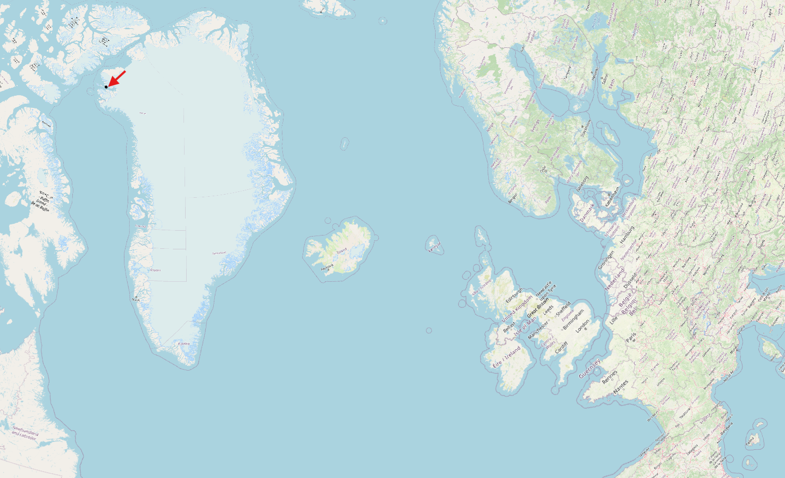

*Greenland with the research area (Qaanaaq region) indicated.*

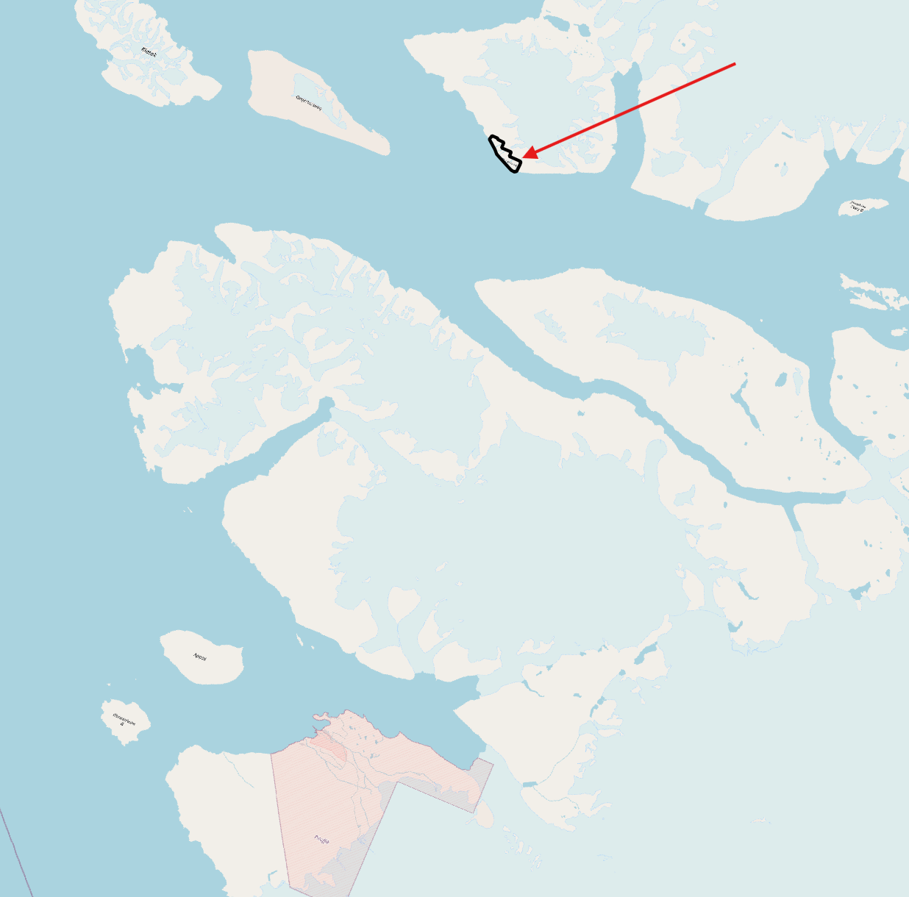

*Detailed map of northern Greenland showing where Qaanaaq is.*

## Current best prediction

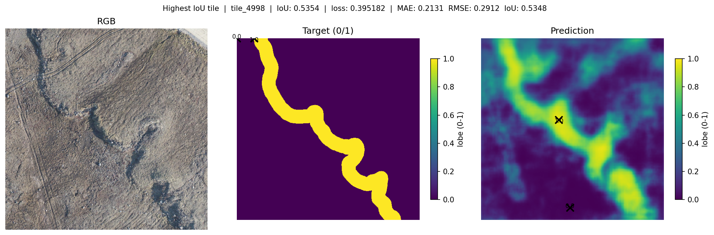

*Best single-tile prediction (tile_4998, IoU 0.54). Model: SatlasPretrain ResNet50 encoder + U-Net decoder with SE and PPM, 5 input channels (RGB + segmentation + slope-stripes), BCE loss with pos_weight=5, binary target mode. Trained on 403 sun-only 512x512 tiles with augmentation (geometric + color/gamma/hue), train_subsample_ratio=0.8, lr=1.5e-5, weight_decay=0.002. Encoder unfreezing and other regularization strategies are being explored to push past the current ceiling.*

---

## Setup

**Poetry (recommended)**

```bash
poetry install
poetry shell
```

**Manual**

```bash
pip install -e .
# Optional (SatlasPretrain models): pip install satlaspretrain-models
```

See `pyproject.toml` for full dependencies. Spatial reference: EPSG:3413 (see `configs/project_metadata.yaml`).

**Optional (segmentation layer):** `pip install scikit-image` — required only for `create_segmentation_layer.py` (not in Poetry to avoid dependency conflicts).

**QGIS:** We use [QGIS](https://qgis.org/) to **edit vector layers** (e.g. research boundary, shadow mask, lobe outlines) and as a **desktop GIS to browse terrain**, inspect rasters and vectors, and check the extent of layers and tiles. Scripts output shapefiles and GeoJSON with optional QML styles for use in QGIS.

---

## Research boundary (AOI)

Limiting work to a **research boundary** (area of interest) keeps processing and training focused on the region you care about: lower cost, consistent extent for manual edits (e.g. lobe outlines, shadow mask), and the same AOI used for synthetic shape placement and tile filtering. Many steps can use this boundary so only that region is processed or trained on.

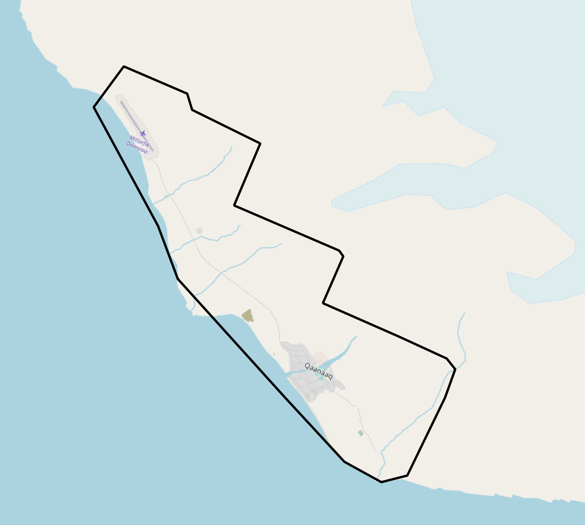

- **Boundary file:** `data/raw/vector/research_boundary.shp` — create in QGIS (or use another vector). Used by default where applicable.
- **Synthetic parenthesis:** Placement is inside the boundary only (script uses this file by default).
- **Segmentation layer:** Pixels outside the boundary are written as nodata (default: use this boundary).
- **Training:** Filter the tile list to tiles that intersect the boundary, then point config at the filtered list (see [Limiting training to the boundary](#limiting-training-to-the-boundary)).

**Optional – auto-extracted boundaries:** If you prefer valid-data polygons (non-white areas) instead of a manual boundary:

```bash
poetry run python scripts/extract_imagery_boundaries.py -i data/raw/raster/imagery/qaanaaq_rgb_0_2m.tif -o data/processed/vector/imagery_valid_boundaries.geojson
```

Use the output with `-b` in scripts that accept a boundary.

---

## Tile registry

**Purpose of tiling:** The source rasters (imagery, DEM, slope, etc.) are too large to feed to the CNN at once. We split them into fixed-size **tiles** (e.g. 256×256 or 512×512 pixels) so the model trains on manageable patches; overlap between tiles keeps continuity at edges.

**How tiles are created:** Scripts (e.g. `create_tiles.py` or the full `prepare_training_data.py`) slide a grid over the source rasters with a given tile size and overlap, writing one feature GeoTIFF (and matching target) per tile. Filtering drops invalid tiles; the **tile registry** is then built from the filtered list and stores metadata for each tile without having to open every file.

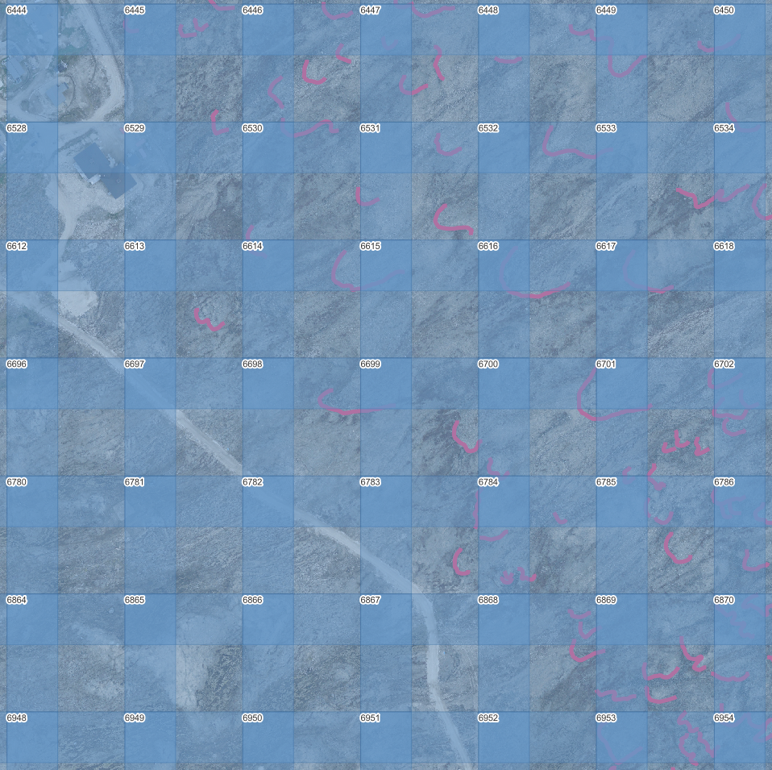

A **tile registry** (`tile_registry.json`) is a single source of truth for that metadata: geographic bounds, filtering status, train/val/test split, and whether each tile lies inside the research boundary. It is used to limit training to the AOI without opening every GeoTIFF.

**What’s in it**

- **Metadata:** `source_raster`, `tile_size`, `overlap`, `crs`, `created`, `last_updated`.
- **Per tile:** `tile_id`, `tile_idx`, `geographic_bounds` (minx, miny, maxx, maxy), `pixel_bounds` (row/col in source raster), `filtering` (e.g. `is_valid`, `rgb_valid`, `has_targets`), `split` (train / val / test). Optional: `paths` (features/targets), `baseline_metrics`, `**inside_boundary`** (true/false – set when the registry is built or updated with a boundary), `**illumination**` and `**illumination_metrics**` (shadow/sun/ambiguous – set by `add_illumination_tags.py`).


Example tile entry (one tile from the registry):

```json
{
  "tile_id": "tile_0042",
  "tile_idx": 42,
  "geographic_bounds": { "minx": 123456.0, "miny": 7654321.0, "maxx": 123567.0, "maxy": 7654432.0 },
  "pixel_bounds": { "row_start": 0, "row_end": 512, "col_start": 2048, "col_end": 2560 },
  "filtering": { "is_valid": true, "rgb_valid": true, "has_targets": true },
  "split": "train",
  "inside_boundary": true,
  "illumination": "sun"
}
```


**How it’s created**

- **New registry (train / train_512):**
`create_tile_registry.py` builds the registry from `filtered_tiles.json` and the source raster (or feature tiles). Use `--boundary data/raw/vector/research_boundary.shp` to set `inside_boundary` for each tile.
  ```bash
  poetry run python scripts/create_tile_registry.py \
    --filtered-tiles data/processed/tiles/train_512/filtered_tiles.json \
    --source-raster data/raw/raster/imagery/qaanaaq_rgb_0_2m.tif \
    --features-dir data/processed/tiles/train_512/features \
    --output data/processed/tiles/train_512/tile_registry.json \
    --tile-size 512 --boundary data/raw/vector/research_boundary.shp
  ```
- **Existing registry (add boundary only):**
To add or refresh `inside_boundary` without re-running the full migration:
  ```bash
  poetry run python scripts/add_boundary_to_registry.py \
    --registry data/processed/tiles/train_512/tile_registry.json \
    -b data/raw/vector/research_boundary.shp
  ```
- **Synthetic datasets:**
The full-raster synthetic script (`generate_synthetic_parenthesis_from_raster.py`) writes `tile_registry.json` (with `inside_boundary`) into `synthetic_parenthesis_256/` and `synthetic_parenthesis_512/` automatically.

**How it’s used**

- `**filter_tiles_by_boundary.py`** can use `--registry <path>` so tile bounds come from the registry instead of reading each feature GeoTIFF (faster on large sets).
- You can later limit training or validation to tiles with `inside_boundary: true` by filtering the tile list (e.g. from the registry or from a derived `filtered_tiles.json`).

See [Limiting training to the boundary](#limiting-training-to-the-boundary) for the full flow.

---

## Illumination tagging (sun / shadow / mixed)

Imagery can mix **sunlit** and **shadowed** areas; the same terrain looks different in each. You can tag tiles as **shadow**, **sun**, or **mixed** and then train only on one type (e.g. sun or shadow) to test whether illumination is a problem.

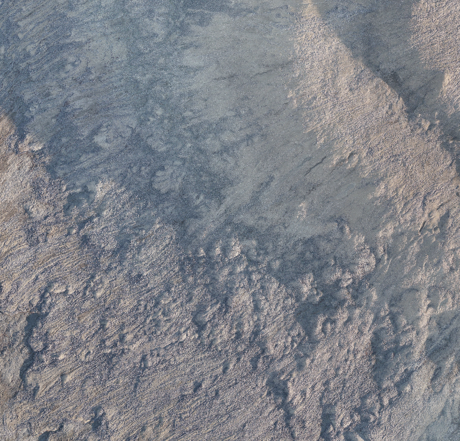

*Same terrain in sun and shadow; we tag tiles so you can train on one type or compare.*

**1. Classify tiles by shadow mask (recommended)**

Use a **hand-drawn shadow mask**: polygons = shadow, everything outside = sun. Tiles are classified by **area fraction** of the tile covered by shadow:

- **shadow**: ≥70% of tile in shadow polygons
- **sun**: ≤30% in shadow (i.e. ≥70% sun)
- **mixed**: between 30% and 70% (configurable threshold)

Run after you have `tile_registry.json` (and optionally `filtered_tiles.json`):

```bash
poetry run python scripts/classify_tiles_by_shadow_mask.py
```

- **Config** `configs/data_preparation_config.yaml` → `**illumination`**: `**shadow_mask**` (e.g. `data/raw/vector/shadow_mask.shp`), `**mixed_threshold**` (default `0.3` → tile is mixed when >30% is the minority class).
- **CLI**: `--shadow-mask PATH`, `--mixed-threshold 0.3`, `--registry`, `--filtered-tiles`, `--qgis-layer`, `--dry-run`.
- Updates `**illumination`** (and empty `**illumination_metrics**`) in **tile_registry.json** and **filtered_tiles.json**; writes **illumination_tiles.geojson** + **.qml** for QGIS (shadow / sun / mixed styling).

**Legacy: add_illumination_tags.py**
Alternative: centroid point-in-polygon from a vector with an attribute, or automatic tagging from RGB (HSV). See config `illumination.illumination_vector` and `illumination.shadow_example_ids` / `sun_example_ids`. Values there are sun / shadow / ambiguous; the recommended pipeline uses **classify_tiles_by_shadow_mask.py** and sun / shadow / mixed.

**2. Train only on sun or shadow**

By default, training uses all tiles. To train only on **sun** or **shadow** tiles (no background):

```bash
poetry run python scripts/train_model.py --illumination-filter sun
# or
poetry run python scripts/train_model.py --illumination-filter shadow
```

- Keeps only tiles whose `**illumination**` matches the filter (**mixed** and background are excluded unless you change config).
- To **include background** when using the filter, set in `configs/training_config.yaml`: `**data.illumination_include_background: true`**.

If you use the extended set (`use_background_and_augmentation: true`), re-run `**prepare_extended_training_set.py**` after classifying tiles so augmented entries inherit `**illumination**` from the source lobe tile.

---

## Input layers (channels)

The model can use several **input channels**. At least one must be enabled in the `layers:` section of `configs/training_config.yaml`; you can ablate channels by setting `enabled: false`.

| Layer | Name in config | Bands | Normalization | Description |
|-------|---------------|-------|---------------|-------------|
| **R, G, B** | `rgb` | 3 | rgb (/255) | Red, green, blue from the aerial imagery. |
| **DEM** | `dem` | 1 | standardize | Digital elevation model. |
| **Slope** | `slope` | 1 | standardize | Terrain slope (derived from DEM). |
| **Slope Stripes** | `slope_stripes` | 1 | clip01 | Gabor-based texture aligned to slope (optional). See [Slope-stripes channel (optional)](#slope-stripes-channel-optional). |
| **Segmentation** | `segmentation` | 1 | segmentation | OBIA-style segment IDs as a boundary hint (optional). See [Segmentation layer (optional)](#segmentation-layer-optional). |

Each layer is stored as **separate tiles** in its own directory (configured via `paths.<mode>.layer_dirs.<name>` in the training config). The `LayerRegistry` handles channel counting, normalization, and tile loading automatically.

**Enabling/disabling layers** — in `training_config.yaml`:

```yaml
layers:
  rgb:
    enabled: true
  dem:
    enabled: false
  slope_stripes:
    enabled: true
```

Experiment YAML overrides work the same way (deep-merged on top of base config).

**Representative tile (good prediction):** tile_7370 — prediction aligns well with target; car tracks are visible on the Slope Stripes panel.

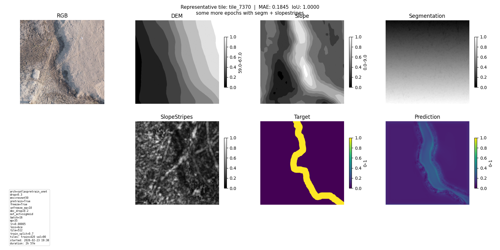

**Minimal detection (for comparison):** tile_6953 — target has many lobe shapes but the model’s prediction is mostly low; illustrates tiles that may need more training.

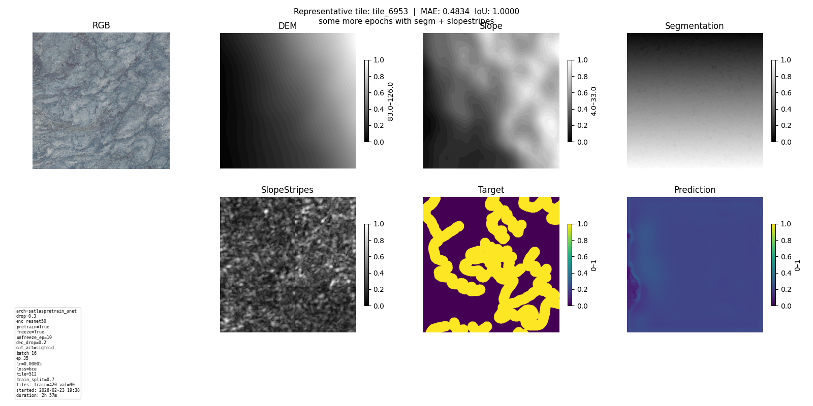

**Gabor slope-stripes sample** (freq=0.15, sigma=5.0) — linear texture aligned with terrain slope:

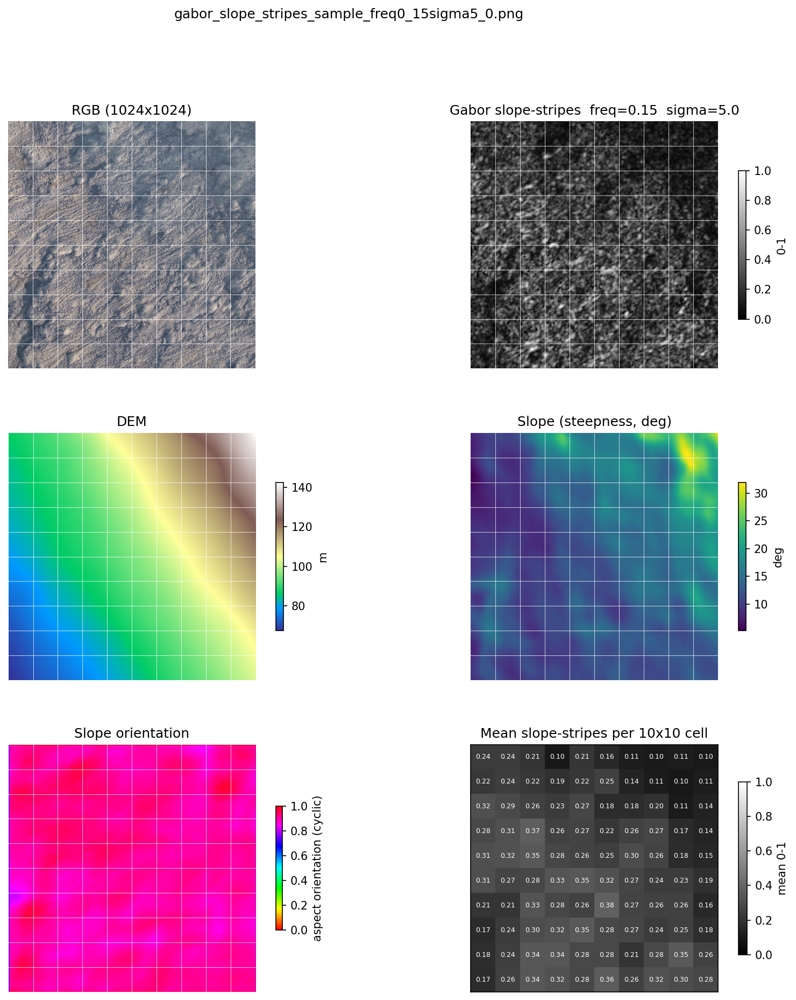

---

## Hyperparameter tuning (Optuna)

Tuning runs multiple training trials with different hyperparameters and can prune poor trials early. Run this **before** full training to find good hyperparameters; then train with `--best-hparams` or `--hp_from_run_id` (see [Training](#training)).

**CLI**

```bash
poetry run python scripts/tune_hyperparameters.py --n-trials 30 [--dev] [--pruning]
```

Common options:


| Option          | Default                                  | Description                                    |
| --------------- | ---------------------------------------- | ---------------------------------------------- |
| `--config`      | `configs/training_config.yaml`           | Base training config                           |
| `--dev`         | off                                      | Use dev tiles (faster, smaller dataset)        |
| `--n-trials`    | 30                                       | Number of Optuna trials                        |
| `--study-name`  | `lobe_detection_hp_tuning`               | Study name (used in storage and MLflow)        |
| `--pruning`     | on                                       | Enable Optuna pruning                          |
| `--no-persist`  | off                                      | Disable persistent storage (in-memory only)    |
| `--results-csv` | `data/optuna_results/<study>_trials.csv` | Where to write trials CSV                      |
| `--no-seed`     | off                                      | Disable seeding first trial from previous best |


Each trial runs training for up to `**num_epochs**` from the config (e.g. 300 in `training_config.yaml`), or until pruning/early stopping. Two **progress plots** are written under `data/optuna_results/` and updated after each trial: (1) `**<study_name>_progress.png`** – trial number vs final value and best-so-far; (2) `**<study_name>_progress_epochs.png**` – validation loss at every epoch across all trials (x-axis labels like T0 E1, T0 E2, …, T1 E1, …). Paths are printed at start (`[PROGRESS] plot_path=...`, `epochs_plot_path=...`); use a viewer that auto-refreshes to follow live.

To **train** (not tune) using hyperparameters from a specific MLflow run (e.g. a past training or tuning run), use `**train_model.py`** with `--hp_from_run_id RUN_ID` (see [Training](#training) optional arguments).

Trials are stored in `data/optuna_studies/<study_name>_<mode>.db` (SQLite) by default. Each trial is logged to MLflow under experiment `lobe_detection_hp_tuning`. Best hyperparameters are written to `configs/best_hyperparameters.yaml` (see script output for path when using custom study name).

**Convenience script**

```bash
./START_HP_TUNING.sh
```

Runs 30 trials with dev tiles and pruning (~8 h order of magnitude). Edit the script to change `--n-trials` or remove `--dev` for production tuning.

---

## Training

**Tracking progress:** During training you can follow **loss** (and optionally MAE) in real time: an in-training plot is updated each epoch, and runs are logged to MLflow so you can compare curves. You can also inspect **best predicted tiles** (e.g. lowest loss or highest IoU) via configurable tile IDs (see `visualization.representative_tile_ids` in config).


**After a run:** You get a **detailed loss plot** (train/val, optional early-stop note such as “Early stop: val_loss (improvement >= 1e-06)”, best epoch). Representative prediction tiles (RGB, target, prediction) are saved as MLflow artifacts and can be viewed in the MLflow UI or in the run folder.

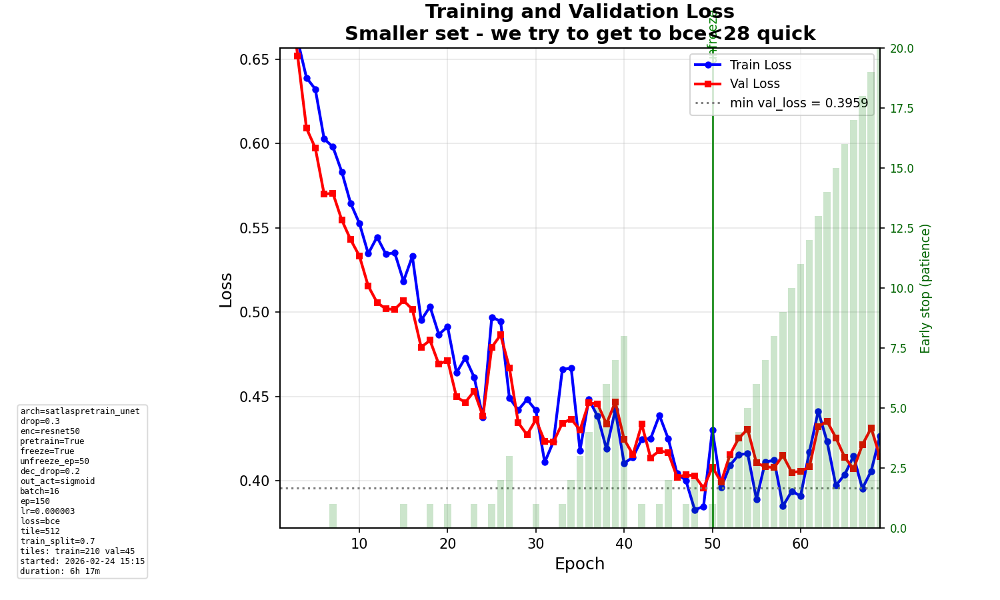

**Why we compute baseline metrics:** We compute **per-tile baseline metrics** (e.g. MAE when predicting 0 everywhere) so we can tell whether the model is **actually learning** or just matching a trivial strategy. Validation reports MAE and “improvement over baseline”; if the model does not beat the naive baseline, the setup or objective may need adjustment. See [docs/baseline_preparation_guide.md](docs/baseline_preparation_guide.md) for details.

### Production training (full dataset)

1. **Prepare data once** (tiles, proximity maps, filtered tile list):
  ```bash
   poetry run python scripts/prepare_training_data.py
  ```
   Output: `data/processed/tiles/train/` (features, targets, `filtered_tiles.json`).
2. **Optional – extended training set** (background tiles + pre-written augmented lobe tiles). Run after step 1 if you want to use `use_background_and_augmentation: true` in config. Options: use `configs/data_preparation_config.yaml` (augmentation and lobes/background ratio) or pass paths explicitly:
  ```bash
   poetry run python scripts/prepare_extended_training_set.py --config configs/data_preparation_config.yaml
  ```
   For 512×512 tiles, set `tile_size: 512` in the config or run with `--tile-size 512` (uses `paths_512`). Default is 256.
   Or without config (default paths for 256):
   Output: `features/augmented/`, `targets/augmented/`, and `extended_training_tiles.json` next to `filtered_tiles.json`. Training then loads this JSON when `use_background_and_augmentation: true`.
3. **Run training** (uses `configs/training_config.yaml` and full AOI tiles):
  ```bash
   poetry run python scripts/train_model.py
  ```
   Optional arguments:
  - `--config PATH` – config file (default: `configs/training_config.yaml`)
  - `--run-name NAME` – MLflow run name
  - `--max-epochs N` – override `num_epochs` (e.g. `--max-epochs 1` for a quick run)
  - `--max-tiles N` – cap total tiles before train/val/test split (for quick runs)
  - `--illumination-filter sun|shadow` – train only on sun or shadow tiles (no background by default; requires illumination tags from `add_illumination_tags.py`). Set `data.illumination_include_background: true` in config to include background.
  - `--best-hparams` – override config with best hyperparameters from `configs/best_hyperparameters.yaml` (from HP tuning)
  - `--best-hparams-path PATH` – path to best-hparams YAML when using `--best-hparams` (default: `configs/best_hyperparameters.yaml`)
  - `--hp_from_run_id RUN_ID` – apply hyperparameters from an MLflow run (e.g. run ID from MLflow UI); takes precedence over `--best-hparams` if both are set
  - `--resume PATH` – continue training from a full checkpoint (`training_latest.pt` or a new-format `best_model.pt` with optimizer, scheduler, and metrics history); see [Warm start (resume)](#warm-start-resume)
  - `--init-weights PATH` – initialize model weights from a previous checkpoint but start a fresh training loop (new optimizer, epoch 1, reset early stopping). Use to fine-tune with different settings (e.g. new loss, pos_weight, unfrozen encoder) without retraining from scratch. See [Init weights (fine-tune)](#init-weights-fine-tune).
  - `--enable-layer NAME` – enable a layer by name (e.g. `--enable-layer dem`)
   - `--disable-layer NAME` – disable a layer by name (e.g. `--disable-layer slope`)
   **Input layers** are configured in `configs/training_config.yaml` under `layers:`. Each layer has `enabled: true/false`. At least one must be enabled. See [Input layers (channels)](#input-layers-channels) for details.
   If using the extended set, ensure `extended_training_tiles.json` exists (optional step above) and `use_background_and_augmentation: true` in config.
   Runs are logged to MLflow (`./mlruns`). When prompted, you can enter a **run intention** (short description); it is stored as the MLflow tag `run_intention` and shown on the loss plot, useful for diary and run comparison. After training, artifacts include loss/MAE/IoU plots and, if configured, prediction-tile visualizations (see `configs/training_config.yaml` → `visualization.representative_tile_ids`).

### Limiting training to the boundary

To train only on tiles that intersect the research boundary:

1. **Create a tile registry** (if you don’t have one) so tile bounds are available. Add `--boundary data/raw/vector/research_boundary.shp` to set `inside_boundary` on each tile (see [Tile registry](#tile-registry)):
  ```bash
   poetry run python scripts/create_tile_registry.py \
     --filtered-tiles data/processed/tiles/train_512/filtered_tiles.json \
     --source-raster data/raw/raster/imagery/qaanaaq_rgb_0_2m.tif \
     --features-dir data/processed/tiles/train_512/features \
     --output data/processed/tiles/train_512/tile_registry.json \
     --tile-size 512 --boundary data/raw/vector/research_boundary.shp
  ```
2. **Filter tiles by boundary:**
  ```bash
   poetry run python scripts/filter_tiles_by_boundary.py \
     --filtered-tiles data/processed/tiles/train_512/filtered_tiles.json \
     -b data/raw/vector/research_boundary.shp \
     --registry data/processed/tiles/train_512/tile_registry.json \
     -o data/processed/tiles/train_512/filtered_tiles_in_boundary.json
  ```
   Without a registry, use `--features-dir data/processed/tiles/train_512/features` instead of `--registry ...` (script will read bounds from each feature GeoTIFF).
3. **Point training at the filtered list:** In `configs/training_config.yaml`, set the path block you use (e.g. `paths.production_512.filtered_tiles`) to `data/processed/tiles/train_512/filtered_tiles_in_boundary.json`, then run `train_model.py` as usual.

### Dev training (small area, fast iteration)

Uses a 1024×1024 cropped area and 36 tiles for quick checks.

1. Prepare dev data:
  ```bash
   poetry run python scripts/prepare_training_data.py --dev
  ```
2. Train:
  ```bash
   poetry run python scripts/train_model.py --dev
  ```
   Optional: `--max-epochs 1` for a single-epoch dry run.

### Experiment sequences

Run structured experiments where each YAML file in `configs/experiments/` contains **overrides** applied on top of `training_config.yaml`. Each experiment includes a `run_intention` (logged to MLflow automatically, skipping the interactive prompt) and an `experiment_name` (used as the MLflow run name).

```bash
# Run a single experiment:
poetry run python scripts/run_experiment_sequence.py --experiments exp_01_baseline.yaml

# Run a batch (sequentially):
poetry run python scripts/run_experiment_sequence.py --experiments exp_01_baseline.yaml exp_02_augmentation.yaml

# Run all exp_*.yaml files (sorted: exp_00_all_tiles → exp_04_…):
poetry run python scripts/run_experiment_sequence.py --all
```

Compare results after runs complete:

```bash
poetry run python scripts/compare_experiments.py --prefix exp_
# or specific runs:
poetry run python scripts/compare_experiments.py --runs exp_02_augmentation exp_03_bce_pos_weight
```

Key config options available in experiment overrides:
- `data.augmentation: true` — enable geometric (flips, 90° rotations) and color (contrast, saturation, brightness, noise) augmentation on all training tiles
- `data.augmentation_config` — fine-tune augmentation parameters (contrast_range, saturation_range, brightness_range, noise_std)
- `data.dataloader_num_workers: N` — DataLoader worker processes (default **0**; **>0** can help on Linux/WSL but on **Windows** often makes training *much* slower—keep **0** unless you benchmarked a gain)
- `training.bce_pos_weight: N` — upweight positive (lobe) class in BCE loss
- `training.max_overfit_gap_ratio: 0.6` — stop training when train-val gap exceeds 60% (overfitting detector)
- `init_weights_from: "data/models/production/best_model.pt"` — initialize model from a previous checkpoint (fresh optimizer, epoch 1); see [Init weights (fine-tune)](#init-weights-fine-tune)

### Warm start (resume)

After each epoch, training writes a **full resume checkpoint** and metadata next to your configured **`models_dir`** (see `paths` in `configs/training_config.yaml`):

- **`training_latest.pt`** – model, optimizer, LR scheduler state, and training loop state (metrics history, early-stopping counters, best val metrics, encoder-unfreeze flag).
- **`warm_start_metadata.json`** – human-readable summary: last completed epoch, target `num_epochs`, mode, best val loss/MAE/IoU, full **`config_snapshot`**, and **`metrics_history`** for plotting the loss curve offline.

**Resume from CLI**

```bash
poetry run python scripts/train_model.py --config configs/training_config.yaml --resume data/models/production/training_latest.pt
```

Use the same config and data layout as the original run (architecture, `in_channels`, paths, tile list). `num_epochs` in config is the **total** cap; training continues from `last_completed_epoch + 1` until that cap or early stopping.

**Inspect and resume interactively**

```bash
poetry run python scripts/resume_from_saved.py --config configs/training_config.yaml
```

Resolves the default manifest from `models_dir`, prints a short summary, saves **`warm_start_loss_preview.png`** next to the manifest, optionally shows the plot (`--show-plot`), then runs `train_model.py --resume …` (use `--yes` to skip the prompt, `--dry-run` for info only).

**MLflow:** A resumed run logs tags `resumed_from_checkpoint` and param `resume_last_completed_epoch`.

**Note:** Checkpoints produced **before** this format existed contain weights only (no `training_loop_state`). Run at least one full epoch with the current code to generate compatible files.

### Init weights (fine-tune)

Use `--init-weights` to start a **new** training run with model weights from a previous checkpoint. Unlike `--resume`, this creates a fresh optimizer, resets early stopping, and starts from epoch 1. Use it when you want to change training settings (loss function, learning rate, pos_weight, unfreeze encoder) while keeping the learned features.

```bash
poetry run python scripts/train_model.py --init-weights data/models/production/best_model.pt
```

| | `--resume` | `--init-weights` |
|---|---|---|
| Model weights | Loaded | Loaded |
| Optimizer state | Restored | Fresh |
| LR scheduler | Restored | Fresh |
| Early stopping | Continues | Reset |
| Start epoch | last + 1 | 1 |

In experiment YAMLs, use `init_weights_from` (path relative to project root):

```yaml
experiment_name: exp_05_pos_weight
run_intention: "from aug best: +pos_weight=5"
init_weights_from: "data/models/production/best_model.pt"
training:
  bce_pos_weight: 5
```

**MLflow:** Logs tag `init_weights_from` with the checkpoint path for lineage tracking.

---

## Viewing results

Start MLflow UI:

```bash
poetry run python scripts/start_mlflow_ui.py
```

Open [http://127.0.0.1:5001](http://127.0.0.1:5001). Use it to compare runs, view metrics, and download artifacts (plots, prediction tiles, logged model).

---

## Configuration

- **Training**: `configs/training_config.yaml` – model architecture, loss, optimizer, epochs, data paths, visualization tile IDs, **input layers** (under `layers:` — each with `enabled`, `bands`, `normalization`; at least one must be enabled), `illumination_filter` and `illumination_include_background` (when training on sun/shadow only).
- **Data preparation / illumination**: `configs/data_preparation_config.yaml` – extended set (background, augmentation) and `**illumination`** (shadow/sun example tile IDs, `ambiguous_max_fraction` or `ambiguous_value_band` for tagging).
- **Loss functions**: See [docs/loss_functions.md](docs/loss_functions.md) for descriptions of all options (`smooth_l1`, `weighted_smooth_l1`, `dice`, `iou`, `soft_iou`, `encouragement`, `focal`, `combined`).
- **Best HP (after tuning)**: `configs/best_hyperparameters.yaml` – can be merged or used to update the main config.
- **Spatial/project**: `configs/project_metadata.yaml`.

Architecture options in config: `unet` (baseline) or `satlaspretrain_unet` (recommended; pretrained encoder). See `configs/training_config.yaml` and `docs/model_architecture.md` for details.

---

## Testing

**Unit tests** (fast, no data required):

```bash
poetry run pytest tests/unit -v
```

**End-to-end tests** (minimal data prep, HP tuning, and training on dev data):

- Require dev data: run `poetry run python scripts/prepare_training_data.py --dev` once.
- Run with the `e2e` marker (slow; ~2–3 min for training + tuning):
  ```bash
  poetry run pytest tests/e2e -m e2e -v
  ```
- What they do:
  - **Minimal training**: 1 epoch on dev tiles (256×256), then check MLflow run and `best_val_loss`.
  - **Minimal tuning**: 1 Optuna trial (1 epoch) on dev tiles, then check trials CSV (state and value).
  - **Data prep then training**: run `prepare_training_data --dev` then 1-epoch training (skips if raw data is missing).

Run unit tests with `pytest tests/unit`; use `pytest tests/e2e -m e2e` when you want to run the slow e2e suite.

---

## Synthetic parenthesis dataset (sanity-check)

When training on real lobe imagery, ground features are not very distinct and the CNN can struggle to learn. To sanity-check that the setup is sound, we use a much simpler task: **embed huge black “(” and “)” shapes on the same imagery** and train the model to detect those. If the architecture and config are reasonable, the model should do well on this obvious target; if it fails even here, the problem is likely with the pipeline or configuration, not with the difficulty of real lobes. Good results on synthetic parenthesis give confidence that the config makes sense before pushing on real data.

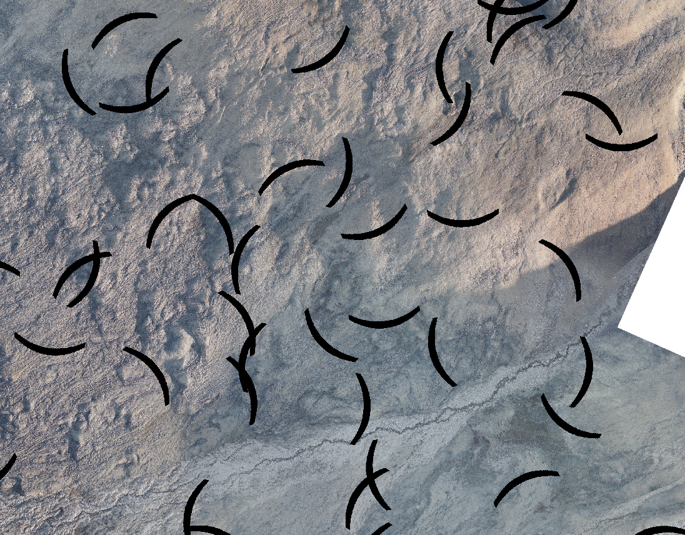

*Black parenthesis shapes overlaid on the same imagery for a sanity-check task.*

**From full raster (recommended)** — uses `data/raw/vector/research_boundary.shp` so shapes are placed only inside the boundary:

1. Ensure DEM and slope are resampled (e.g. already done by `prepare_training_data.py` or `prepare_training_steps.py`).
2. Generate synthetic tiles (256 and 512):
  ```bash
   poetry run python scripts/generate_synthetic_parenthesis_from_raster.py
  ```
   Output: `data/processed/tiles/synthetic_parenthesis_256/` and `synthetic_parenthesis_512/` (features, targets, `filtered_tiles.json`). Override boundary with `-b path/to/vector.shp` or use `-b data/processed/vector/imagery_valid_boundaries.geojson` if you ran `extract_imagery_boundaries.py`.
3. Train in synthetic mode:
  ```bash
   poetry run python scripts/train_model.py --config configs/training_config_synthetic_parenthesis.yaml --mode synthetic_parenthesis
  ```

See `docs/synthetic_parenthesis_dataset.md` for the legacy tile-based generator and details.

---

## Slope-stripes channel (optional)

Optional raster channel (Gabor freq=0.15, sigma=5.0) indicating where linear texture aligns with terrain slope. On normal (unrotated) imagery, slope-aligned stripes produce strong values.


**Run** (after DEM/slope resampling): `poetry run python scripts/create_slope_stripes_channel.py --method gabor --gabor-frequency 0.15 --gabor-sigma 5.0`. Default output: `data/processed/raster/slope_stripes_channel.tif`. Tile with `create_tiles.py` (same size/overlap as features), then set `layers.slope_stripes.enabled: true` and add the tile directory to `paths.<mode>.layer_dirs.slope_stripes` in config. Requires `scikit-image`. `prepare_training_data.py` can generate and tile this channel in one go.

---

## Segmentation layer (optional)

A **separate raster layer** of segment IDs (OBIA-style, Felzenszwalb) can be used as a **6th input channel** to the CNN for boundary hints. By default it is limited to the research boundary (nodata outside). When enabled, the **representative tile** figures (see [Input layers (channels)](#input-layers-channels)) include a Segmentation panel showing segment boundaries over the tile.

- **Requires:** `pip install scikit-image`

### Production (train_512 or train)

- **1) Create the full raster** (default: input = `data/raw/raster/imagery/qaanaaq_rgb_0_2m.tif`, output = `data/processed/raster/imagery_segmentation_layer.tif`, boundary = research_boundary.shp). Skip if `imagery_segmentation_layer.tif` already exists.
  ```bash
  poetry run python scripts/create_segmentation_layer.py
  ```
  Options: `-i` / `-o` for input/output raster, `-b` for boundary (omit to segment full raster), `--scale` / `--scale2` for segment size, `--block-size` for large rasters. See `scripts/create_segmentation_layer.py --help`.
- **2) Tile the segmentation raster** with the **same tile size and overlap** as your feature tiles, so each feature tile has a matching segmentation tile (e.g. for 512×512 production):
  ```bash
  poetry run python scripts/create_tiles.py -i data/processed/raster/imagery_segmentation_layer.tif -o data/processed/tiles/train_512/segmentation --tile-size 512 --overlap 0.3 --no-organize
  ```
  For 256×256 use `-o data/processed/tiles/train/segmentation` and `--tile-size 256`.
- **3) Enable in training:** In `configs/training_config.yaml` set `layers.segmentation.enabled: true` and under the chosen path (e.g. `paths.production_512.layer_dirs`) set `segmentation: "data/processed/tiles/train_512/segmentation"`. The total input channels depend on which layers are enabled.

### Synthetic parenthesis

For the synthetic dataset, the full segmentation raster is created by `create_segmentation_for_synthetic_parenthesis.py` (from `synthetic_rgb_with_shapes.tif`); tiling to 256/512 is done by `generate_synthetic_parenthesis_from_raster.py` or `tile_synthetic_segmentation.py`. See `pipelines/run_synthetic_from_raster_pipeline.sh`.

---

## Other scripts

- **Data**: `rasterize_vector.py`, `generate_proximity_map.py`, `create_tiles.py`, `filter_tiles.py` – building blocks; usually run via `prepare_training_data.py`. **Derived layers:** `create_derived_layer.py` – generic CLI for computing derived layers (e.g. slope stripes) from input rasters using the transform registry; `split_combined_tiles.py` – one-time migration to split multi-band combined tiles into separate per-layer directories. **Slope-stripes:** `create_slope_stripes_channel.py` – Gabor or structure-tensor slope-aligned stripe channel (optional input channel); use `--method gabor --gabor-frequency 0.15 --gabor-sigma 5.0` for the default lobe dataset. **Illumination:** `**classify_tiles_by_shadow_mask.py`** – classify tiles as sun/shadow/mixed from **shadow mask** (polygons = shadow, outside = sun; >30% minority → mixed); update `tile_registry.json` and `filtered_tiles.json`, write QGIS layer; config: `illumination.shadow_mask`, `illumination.mixed_threshold`. Legacy: `add_illumination_tags.py` (centroid or RGB).
- **Boundary / AOI**: `extract_imagery_boundaries.py` – vectorize valid-data (non-white) regions to GeoJSON; `filter_tiles_by_boundary.py` – filter `filtered_tiles.json` to tiles intersecting a boundary (e.g. research_boundary.shp).
- **Synthetic**: `generate_synthetic_parenthesis_from_raster.py` – full-raster synthetic parenthesis inside boundary, then tile to 256/512; `generate_synthetic_parenthesis_dataset.py` – legacy tile-based synthetic data.
- **Segmentation**: `create_segmentation_layer.py` – OBIA-style segment ID raster (optional CNN hint), limited to boundary by default.
- **Training resume**: `resume_from_saved.py` – show `warm_start_metadata.json`, optional loss preview, then continue with `train_model.py --resume` (see [Warm start (resume)](#warm-start-resume)).
- **Analysis**: `compute_baseline_metrics.py`, `analyze_per_tile_performance.py`, `compare_runs.py`.
- **QGIS**: `generate_tile_index_shapefile.py` – tile index shapefile for the map; use `--tile-size 512` for 512×512 tiles (requires a registry in `train_512/`). **Synthetic parenthesis:** `generate_synthetic_parenthesis_shapefile.py --tile-size 256` (or `512`) – writes `tile_index.shp` and QML styles into the synthetic tile directory for QGIS.

See `docs/PROJECT_STRUCTURE.md` for folder layout and `docs/` for guides (e.g. `training_how_it_works.md`, `training_visualization.md`, `OPTUNA_QUICK_START.md`, `synthetic_parenthesis_dataset.md`, `plan_synthetic_parenthesis_and_multiscale.md`).
