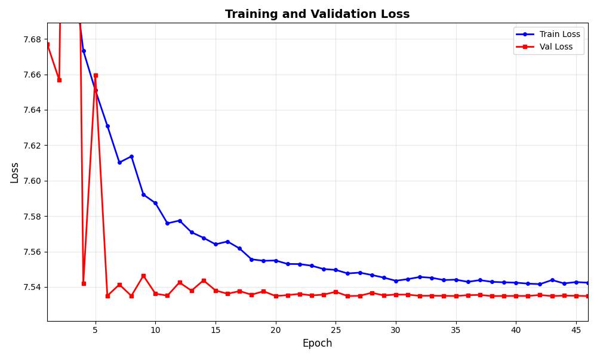
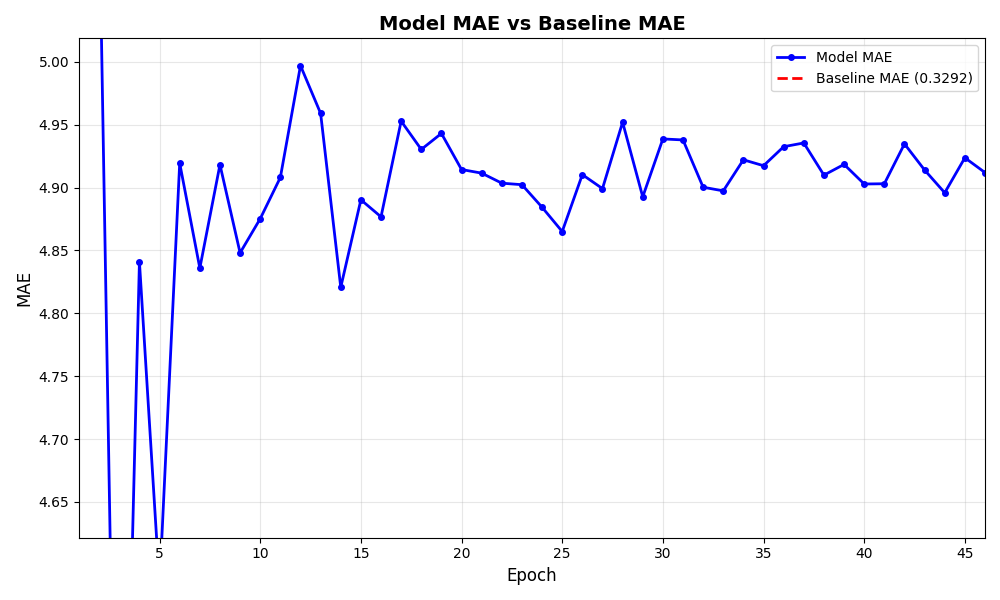

# Daily Diary: January 21, 2026

## Overview

Focused on addressing the critical issue: **model IoU stuck at 0.0-0.06** despite multiple loss function experiments. The model continues to predict low values (~0.4) for all pixels, never crossing the 1.0 threshold needed for lobe detection.

## Key Runs Analyzed

### Run 1: Combined Loss (IoU + Weighted Smooth L1) - `1ba6169a`
**Configuration:**
- Loss: `combined` (IoU weight: 0.5, regression weight: 0.5)
- Learning rate: 0.01
- Dataset: Production (1,854 train tiles, 397 val tiles)
- Epochs: 60

**Results:**
- ❌ **IoU = 0.0** throughout all 60 epochs
- Model failed to learn any lobe patterns
- Combined loss didn't break the local minimum

**Insight:** Soft IoU component wasn't providing strong enough gradients to escape the background-dominated loss landscape.

---

### Run 2: Combined Loss (Second Attempt) - `65c9110a`
**Configuration:**
- Loss: `combined` (same weights as Run 1)
- Learning rate: 0.01
- Dataset: Production
- Epochs: 24 (stopped early)

**Results:**
- ❌ **IoU = 0.0** (no improvement)
- Val MAE: ~0.6-0.7 (better than Run 3, but still worse than baseline)
- Early stopping triggered

**Insight:** Combined loss approach not effective. Model still collapsing to background predictions.

---

### Run 3: Encouragement Loss - `7caed837` ⭐ **Most Recent**
**Configuration:**
- Loss: `encouragement` (weight: 10.0)
- Learning rate: 0.01
- Dropout: 0.2 (decoder only)
- Weight decay: 0.001
- LR scheduler: ReduceLROnPlateau (patience: 10, factor: 0.5)
- Early stopping: patience 20
- Gradient clipping: max_norm = 1.0
- Dataset: Production (1,854 train, 397 val)
- Epochs: 45 (out of 500 planned)

**Results:**
- ⚠️ **IoU = 0.0647** (constant, no learning)
- Val MAE: ~4.9 (epoch 3: 4.20, then plateaued at 4.8-4.9)
- Val Loss: Plateaued at ~7.54 after epoch 4
- **Baseline MAE: 0.329** | **Model MAE: 4.9** → **15x worse than baseline**
- Model predictions: All values ~0.4 (never crossing 1.0 threshold)

**Key Observations:**
1. Encouragement loss with weight=10.0 insufficient to break local minimum
2. Model stuck predicting background values despite explicit penalty
3. Training loss decreasing (10.08 → 7.54) but validation loss plateaued
4. Learning rate scheduler didn't trigger (loss not improving enough)

**Visualizations Generated:**
- Loss curves (train vs val)
- MAE comparison (model vs baseline)
- IoU progression (flat at 0.0647)
- Improvement percentage (negative, model worse than baseline)

*Loss progression showing early improvement followed by plateau. Training loss continues decreasing while validation loss plateaus after epoch 4, indicating the model is stuck in a local minimum.*

---

## What Worked

1. **Infrastructure Improvements:**
   - ✅ MLflow integration fully functional
   - ✅ Training visualization module created (`src/training/visualization.py`)
   - ✅ Per-tile baseline comparison implemented
   - ✅ Comprehensive metrics logging (baseline MAE, improvement %)

2. **Model Architecture:**
   - ✅ Dropout (0.2) added to decoder path
   - ✅ Gradient clipping implemented (prevents exploding gradients)
   - ✅ Learning rate scheduling infrastructure in place

3. **Diagnostic Capabilities:**
   - ✅ Prediction diagnostics (min, max, mean, % above threshold)
   - ✅ Baseline comparison metrics
   - ✅ Training plots automatically logged to MLflow

---

## What Didn't Work

1. **Loss Functions:**
   - ❌ **Combined Loss**: IoU + Weighted Smooth L1 → IoU = 0.0
   - ❌ **Encouragement Loss** (weight=10.0): IoU stuck at 0.0647
   - Both approaches failed to break the class imbalance problem

2. **Learning Rate:**
   - LR = 0.01 may still be too high, causing early plateau
   - LR scheduler never triggered (loss not improving enough to reduce)

3. **Model Learning:**
   - Model consistently predicts ~0.4 for all pixels
   - Never crosses 1.0 threshold needed for IoU calculation
   - 93.5% background pixels dominate loss, model minimizes by predicting background

---

## Key Insights

*MAE comparison clearly shows the model (orange) performing ~15x worse than the naive baseline (blue) throughout training. This demonstrates the fundamental learning problem.*

### Root Cause Analysis

The fundamental problem: **Extreme class imbalance (93.5% background, 6.5% lobes)** causes the model to minimize loss by predicting low values everywhere. Current loss functions don't provide strong enough gradients to escape this local minimum.

### Why Encouragement Loss Failed

- Weight=10.0 insufficient for the severity of imbalance
- Model can still minimize overall loss by predicting ~0.4 everywhere
- Penalty for low predictions on lobes not strong enough relative to background dominance

### Model Behavior Pattern

All runs show the same pattern:
1. Initial epochs: Some learning (loss decreases)
2. Epoch 3-5: Quick improvement then plateau
3. Remaining epochs: Stuck at local minimum
4. IoU: 0.0 or near-zero (0.0647)
5. Predictions: Uniformly low (~0.4), never crossing threshold

---

## Metrics Summary

| Run ID | Loss Function | IoU (Final) | Val MAE (Final) | Baseline MAE | Status |
|--------|---------------|-------------|-----------------|--------------|--------|
| `1ba6169a` | combined | 0.0 | N/A | 0.329 | ❌ Failed |
| `65c9110a` | combined | 0.0 | ~0.65 | 0.329 | ❌ Failed |
| `7caed837` | encouragement | 0.0647 | 4.92 | 0.329 | ⚠️ Stuck |

**Best Run:** `7caed837` (encouragement loss) - slightly better than combined loss, but still fundamentally broken.

---

## Documentation Created

1. **`docs/model_architecture.md`** - Comprehensive model documentation
   - Architecture details
   - Loss functions explained
   - Current issues and solutions
   - Data flow pipeline

2. **Training visualization module** - Automated plot generation
   - Loss curves
   - MAE comparisons
   - IoU progression
   - Improvement percentages

---

## Lessons Learned

1. **Class imbalance is the core problem**, not architecture or hyperparameters
2. **Standard loss functions insufficient** for 93.5% background imbalance
3. **Model needs stronger incentives** to predict lobe pixels
4. **Baseline comparison essential** - shows model is 15x worse than naive baseline
5. **Infrastructure investments paying off** - MLflow tracking makes analysis possible

---

## Time Investment

- **Training runs:** ~4-6 hours total (multiple production runs)
- **Analysis & documentation:** ~2 hours
- **Infrastructure improvements:** ~1 hour

**Total:** ~7-9 hours focused on understanding and diagnosing the learning problem.

---

## Conclusion

Yesterday's work confirmed that the model learning problem is **fundamental and loss-function related**, not a simple hyperparameter tuning issue. The model is stuck in a local minimum where predicting background everywhere minimizes loss. The root cause is extreme class imbalance (93.5% background), and current loss functions are insufficient to break this pattern.

**Status:** Problem clearly identified, ready for next implementation phase.
