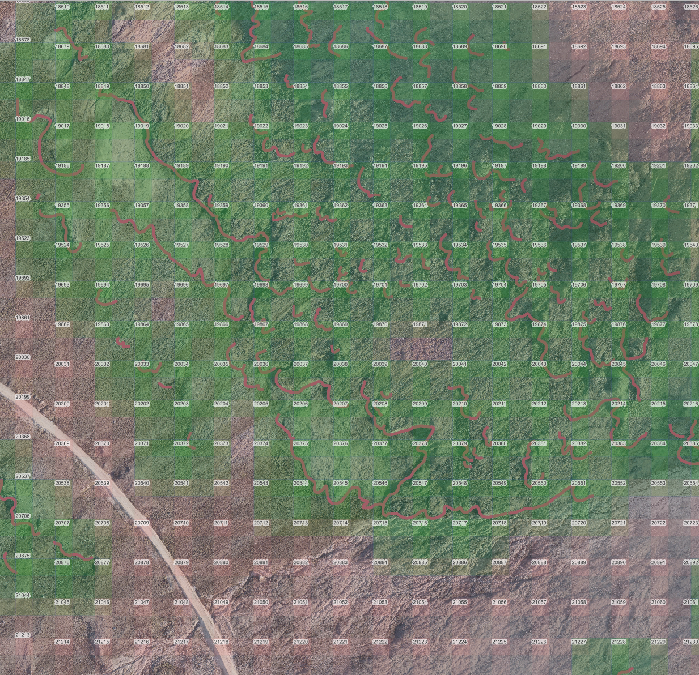

# Daily Diary: January 23, 2026

## Overview

**Major accomplishment**: Implemented a comprehensive tile visualization system for QGIS, enabling visual inspection of the training data distribution, tile filtering status, and geographic coverage. This provides critical infrastructure for understanding data quality and model performance at the tile level.

## Key Infrastructure Work

### 1. Tile Registry System Implementation

**Purpose**: Created a single source of truth for tile metadata, including geographic bounds, filtering status, train/val/test splits, and model performance metrics.

**New Components Created:**
- `src/map_overlays/tile_registry.py` - `TileRegistry` class managing tile metadata
- `src/map_overlays/shapefile_generator.py` - Shapefile generation for QGIS visualization
- `src/map_overlays/__init__.py` - Package initialization
- `scripts/create_tile_registry.py` - Initial migration script from `filtered_tiles.json`
- `scripts/generate_tile_index_shapefile.py` - Standalone shapefile generation script

**Key Features:**
- Geographic bounds calculation for all tiles (EPSG:3413)
- Integration with existing `filtered_tiles.json` data
- Support for per-tile model metrics storage (MAE, RMSE, IoU, improvement over baseline)
- Automatic updates after each training run (integrated into `train_model.py`)

**Registry Structure:**
```json
{
  "metadata": {
    "source_raster": "...",
    "tile_size": 256,
    "overlap": 0.3,
    "crs": "EPSG:3413",
    "created": "...",
    "last_updated": "..."
  },
  "tiles": {
    "tile_0000": {
      "tile_id": "tile_0000",
      "tile_idx": 0,
      "geographic_bounds": {
        "minx": -563060.13,
        "miny": -1237562.70,
        "maxx": -563008.93,
        "maxy": -1237511.50
      },
      "filtering": {
        "is_valid": true,
        "rgb_valid": true,
        "has_targets": true
      },
      "split": "train",
      "target_stats": {...},
      "model_metrics": {...}
    }
  }
}
```

### 2. QGIS Shapefile Visualization

**Output**: `data/processed/tiles/train/tile_index.shp` with 34,476 tiles

**Features Implemented:**
- **Tile numbering**: Each tile displays its ID (e.g., "10020") in the top-left corner
- **Categorized styling**: Different fill colors based on filtering status
  - **Green tiles**: Filtered/valid tiles (2,650 tiles) - semi-transparent blue-green fill
  - **Reddish-brown tiles**: Not filtered/invalid tiles (31,826 tiles) - semi-transparent reddish fill
- **Semi-transparent fills**: Allows underlying terrain imagery to remain visible
- **QML style file**: Auto-generated for consistent styling in QGIS

**Visualization Capabilities:**
- Overlay on source raster imagery (`qaanaaq_rgb_0_2m.tif`)
- Visual inspection of tile distribution and coverage
- Identification of filtered vs. non-filtered tiles
- Tile overlap visualization (30% overlap = ~15.36m per tile)
- Integration with lobes layer for spatial context



*Screenshot showing terrain photo layer, numbered tiles (with IDs in top-left corners), filtered tiles colored green, and lobes overlaid. The visualization clearly shows the distribution of valid training tiles across the landscape.*

### 3. Training Script Cleanup

**Changes to `scripts/train_model.py`:**
- Replaced all `print()` statements with structured `logging` calls (per `.cursorrules.md`)
- Added tile registry integration:
  - Loads or initializes `TileRegistry` at start
  - After training, calculates per-tile metrics on validation set
  - Updates registry with model performance metrics
- Fixed f-string formatting issues in normalization logging
- Added missing `import numpy as np`

**Tile Registry Update Process:**
1. After training completes, loads best model checkpoint
2. Iterates through validation tiles
3. Calculates per-tile MAE, RMSE, IoU
4. Computes improvement over baseline for each tile
5. Updates `tile_registry.json` with metrics
6. Automatically triggers shapefile regeneration (future enhancement)

### 4. QGIS Style File (QML) Generation

**Automatic QML Generation:**
- Created alongside shapefile during generation
- Categorized renderer based on `is_valid` field
- Labels positioned at top-left corner using geometry generator
- Semi-transparent fills (20% opacity for invalid, 40% for valid tiles)
- White text buffers for label readability

**Label Configuration:**
- Field: `tile_label` (tile ID without "tile_" prefix)
- Position: Top-left corner via `make_point(x_min($geometry), y_max($geometry))`
- Offset: 5 map units (~1m) from corner
- Font: Arial, 8pt, dark gray with white buffer

## Technical Details

### Tile Overlap Verification

**User observation**: Tiles appeared non-overlapping in QGIS visualization.

**Investigation**: Verified that tiles do overlap correctly:
- Full tile size: 256 pixels × 0.2m = **51.2m**
- Stride (non-overlapping portion): 179.2 pixels × 0.2m = **35.84m** ≈ 36m
- Overlap: 76.8 pixels × 0.2m = **15.36m** (30% overlap)

**Resolution**: The 36m measurement in QGIS represents the stride (non-overlapping distance between tile centers), not the full tile size. Overlap is present but subtle - approximately 15.36m on each side where tiles overlap.

### Geographic Bounds Calculation

**Method**: Uses rasterio's `transform.xy()` to convert pixel coordinates to geographic coordinates:
```python
corners = [
    rasterio.transform.xy(tile_transform, 0, 0),  # Top-left
    rasterio.transform.xy(tile_transform, 0, width),  # Top-right
    rasterio.transform.xy(tile_transform, height, 0),  # Bottom-left
    rasterio.transform.xy(tile_transform, height, width),  # Bottom-right
]
```

**CRS**: EPSG:3413 (WGS 84 / NSIDC Sea Ice Polar Stereographic North)

## Statistics

**Tile Registry:**
- Total tiles: 34,476
- Valid (filtered) tiles: 2,650 (7.7%)
- Invalid tiles: 31,826 (92.3%)

**Split Distribution:**
- Train: 1,854 tiles (70.0% of valid tiles)
- Validation: 397 tiles (15.0% of valid tiles)
- Test: 399 tiles (15.1% of valid tiles)

## Impact

**Immediate Benefits:**
- Visual verification of tile distribution and coverage
- Easy identification of filtered vs. non-filtered tiles
- Foundation for per-tile model performance visualization
- Quality control tool for data preparation pipeline

**Future Enhancements Enabled:**
- Per-tile model metrics visualization (MAE, RMSE, IoU)
- Heat maps showing model performance across study area
- Identification of problematic tiles (high error, low IoU)
- Spatial analysis of model performance patterns

## Files Created/Modified

**New Files:**
- `src/map_overlays/tile_registry.py`
- `src/map_overlays/shapefile_generator.py`
- `src/map_overlays/__init__.py`
- `scripts/create_tile_registry.py`
- `scripts/generate_tile_index_shapefile.py`
- `data/processed/tiles/train/tile_registry.json` (872,960 lines)
- `data/processed/tiles/train/tile_index.shp` (+ associated files)
- `data/processed/tiles/train/tile_index.qml`

**Modified Files:**
- `scripts/train_model.py` - Added logging, tile registry integration
- `docs/daily_diary/2026-01-23.md` - This file

## Next Steps

1. **Model Performance Visualization**: After next training run, visualize per-tile metrics in QGIS
2. **Performance Heat Maps**: Create color-coded tiles based on MAE/IoU values
3. **Problematic Tile Analysis**: Identify tiles with consistently poor performance
4. **Spatial Pattern Analysis**: Investigate if model performance correlates with terrain features
