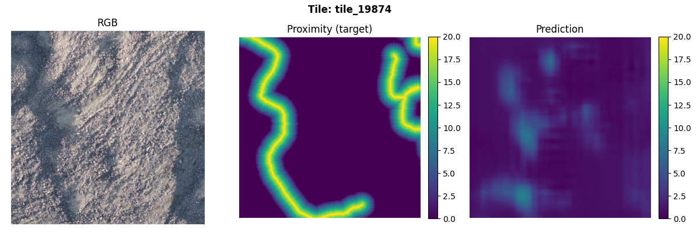

# Daily Diary - January 30, 2026

## Overview

Focused on **prediction tile visualization**, **training UX**, and **README**:

1. **Representative-tile visualization**: After each training run (non-Optuna), MLflow artifacts include prediction figures for a configurable list of tiles (RGB, proximity target, prediction). Config: `visualization.representative_tile_ids` (production) and `representative_tile_ids_dev` (dev). Tiles editable in `configs/training_config.yaml`.
2. **RGB display fix**: Prediction-tile RGB panel was showing black (feature tiles stored as float 0–1, dataloader divided by 255 again). Fixed by loading raw RGB from the feature file and scaling for display (handles both 0–255 and 0–1).
3. **Metrics and baselines on figures**: Per-tile MAE, RMSE, IoU added to figure title; baseline (predict 0) MAE and IoU from `target_stats.baseline_metrics` added as a second line when present.
4. **Training CLI**: `--best-hparams` to apply best hyperparameters from `configs/best_hyperparameters.yaml`; `--max-epochs N` for quick runs. Clarified that HP tuning results are not used by default unless `--best-hparams` is set.
5. **README**: Rewritten as a user-facing guide: production training, dev training, hyperparameter tuning (Optuna, `START_HP_TUNING.sh`), viewing results, config pointers.

## Illustration

Example prediction tile figure (tile_19874): RGB input, proximity target, and model prediction with per-tile metrics and baseline in the title.

## What We Added (Code)

### 1. Prediction tile visualization (from backlog #8)

- **Config**: `configs/training_config.yaml` → `visualization.representative_tile_ids` (e.g. `[19189, 19874, 20208, 20380, 20707]`) and `representative_tile_ids_dev` (e.g. `[0, 7, 17, 28, 35]` for dev).
- **Resolution**: `resolve_representative_tiles(all_tiles, config_ids)` matches by integer index (e.g. `19189` → tile whose id ends with `_19189`) or exact `tile_id` string.
- **Figures**: One figure per tile: RGB | Proximity (target) | Prediction (same 0–20 scale, viridis). Logged to MLflow as `prediction_tiles/{tile_id}.png`.
- **Dev vs production**: Dev has 36 tiles (1024×1024 cropped, 6×6 grid), ids `tile_0000`–`tile_0035` (index 0–35). Production uses full AOI; config accepts indices or full `tile_id`.
- **Best checkpoint**: Before creating prediction figures, the best checkpoint is loaded so figures reflect the best epoch.

### 2. RGB display for prediction tiles

- **Issue**: RGB panel was black (feature tiles float 0–1, `normalize_rgb` divided by 255 → ~0).
- **Fix**: `_load_rgb_for_display(features_path)` reads bands 1–3 from the feature file; if `max > 1` then divide by 255, else use as-is; clip to [0, 1]. Display uses this; model input unchanged.

### 3. Metrics and baselines on figures

- **Model metrics**: Per-tile MAE, RMSE, IoU (same `iou_threshold` as training) computed and shown in title: `Tile: {id}  |  MAE: x.xx  RMSE: x.xx  IoU: x.xx`.
- **Baselines**: From `tile_info["target_stats"]["baseline_metrics"]`: `baseline_mae.predict_zero`, `baseline_iou.predict_zero`. When present, second line: `Baseline (predict 0): Baseline MAE: x.xx  Baseline IoU: x.xx`.
- **Helpers**: `_compute_tile_metrics(pred_np, target_np, iou_threshold)`, `_get_tile_baselines(tile_info)`.

### 4. `--best-hparams` for training

- **CLI**: `--best-hparams` applies overrides from `configs/best_hyperparameters.yaml`; `--best-hparams-path PATH` for a custom file.
- **Mapping**: `apply_best_hyperparameters(config, path)` maps `hyperparameters` keys (learning_rate, batch_size, loss_function, encoder_name, focal_alpha, focal_gamma, decoder_dropout, lr_scheduler_*, max_grad_norm, unfreeze_after_epoch, weight_decay) into `config["training"]` and `config["model"]`.
- **Error**: If `--best-hparams` is set and the file is missing, training exits with `FileNotFoundError`.

### 5. `--max-epochs` and dry run

- **CLI**: `--max-epochs N` overrides `num_epochs` from config (e.g. `--max-epochs 1` for a quick check).
- **Unit tests**: `tests/unit/test_visualization.py` for `_tile_id_to_index` and `resolve_representative_tiles` (match by int, by str, empty, no match, mixed).
- **Single-epoch plot fix**: When only one epoch, xlim set to `[epoch, epoch+1]` to avoid matplotlib “identical limits” warning.

### 6. README

- **Sections**: Setup; Production training (prepare data → `train_model.py`, optional `--config`, `--run-name`, `--max-epochs`, `--best-hparams`, `--best-hparams-path`); Dev training; Hyperparameter tuning (Optuna CLI options table, `START_HP_TUNING.sh`, where results go); Viewing results (MLflow UI); Configuration; Other scripts and docs.

## Repo / workflow

- **Modified**: `configs/training_config.yaml` (visualization section, representative_tile_ids, representative_tile_ids_dev), `scripts/train_model.py` (best-checkpoint load, prediction tile block, `apply_best_hyperparameters`, `--best-hparams`, `--best-hparams-path`, `--max-epochs`, pass `iou_threshold` to viz), `src/training/visualization.py` (resolve_representative_tiles, _tile_id_to_index, prediction tile figure with metrics and baseline, _load_rgb_for_display, _compute_tile_metrics, _get_tile_baselines, single-epoch xlim), `docs/improvements_backlog.md` (item 8 status), `docs/training_visualization.md` (prediction tile section, dev vs production IDs), `README.md` (full rewrite).
- **New**: `tests/unit/test_visualization.py` (tests for tile resolution and tile_id parsing).

## HP tuning (today)

Results were exported to **`data/optuna_results/lobe_detection_hp_tuning_trials.csv`** (export 2026-01-31). The study **resumed** across Jan 30–31; trial numbers continued from 5 in session **`20260131T210511_6b0d6988`**.

### Summary from CSV (after export)

| Session / date   | Trials | Best in session (val_loss) | Best config                    |
|------------------|--------|----------------------------|--------------------------------|
| legacy / 20260128T130640 / 20260128T193507 / 20260129T085712 | 0–4 | **3.443** (trial 1) | resnet50, combined             |
| 20260131T210511  | 5–24   | **3.4048** (trial 16)      | resnet50, combined (**new best**) |

- **Best validation loss (all time)**: **3.4048** — session `20260131T210511`, **trial 16** (resnet50, combined, lr≈5.5e-4, batch 8, decoder_dropout≈0.16, unfreeze_after_epoch 1). best_val_mae 1.986, best_val_iou 0.149.
- **Trial 4** (swin_v2_base, combined): COMPLETE 3.493 (Jan 30 run); trial 6 (resnet50, combined): 3.4404; trial 16 improves on both.
- **Focal trials**: 17 (0.43), 18 (0.84) completed with very low objective — different loss scale; for comparison with combined, use trial 16.
- **Failures**: Trial 5 (resnet50, combined) FAIL; trial 8 (swin_v2_tiny, weighted_smooth_l1, batch 64) 1e9; trial 11 (focal, swin_v2_tiny) 1e9; trial 23 (focal, resnet50) FAIL.
- **Pruned**: 7, 9, 10, 12–15, 19–22 (various encoders/losses). Trial 24 WAITING at export time.
- **best_hyperparameters.yaml**: Update from the script after this export would point to trial 16 (combined, resnet50) if the script writes best-by-value; otherwise manually update to trial 16 params for production training with `--best-hparams`.

## Notes

- **100% lobes**: User saw `Pixels >= 1.0: pred=100%, target=14%` — model predicting “lobe” everywhere. Explained as a failure mode (no background/lobe separation); recommended longer training and/or loss/hyperparameter tuning. Using `--best-hparams` applies the HP-tuning best config (e.g. combined loss, lower lr) which may help.
- **Pretrained layers**: Confirmed the model uses SatlasPretrain pretrained encoder when `training_config.yaml` has `architecture: satlaspretrain_unet` and `encoder.pretrained: true`; HP tuning results are only applied when `--best-hparams` is passed.
