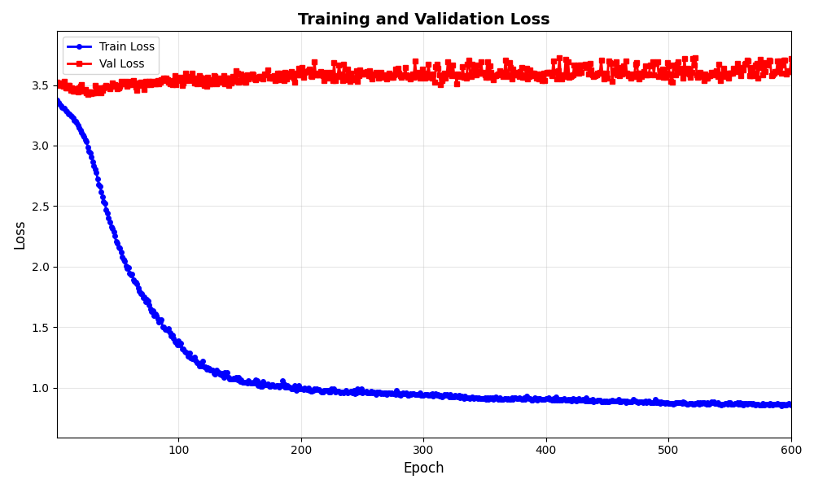
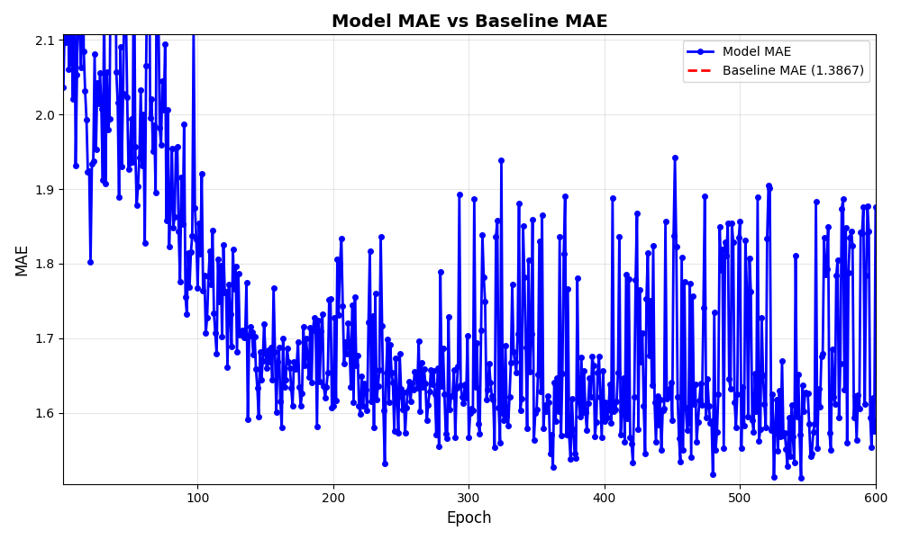
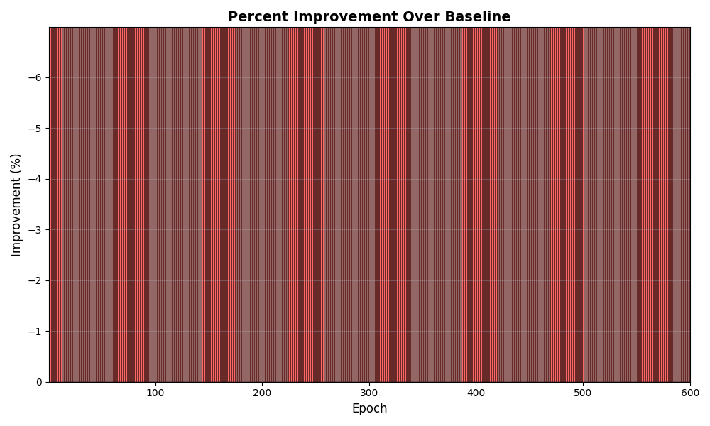

# Daily Diary - February 2, 2026

## Overview

Documented the long **production run ea6479a3** (600 epochs, combined loss from HP run) and summarized the **last two weeks** with focus on learning progress and persistent gaps.

---

## Key Run: ea6479a306ed402a81b959eb897de776

### Run summary

| Field | Value |
|--------|--------|
| **Run ID** | `ea6479a306ed402a81b959eb897de776` |
| **Run name** | unet_baseline_production |
| **Mode** | production |
| **Epochs** | 600 |
| **HP source** | MLflow run `c8b7ee67abd94e5a9f0c35285c958a8b` (`--hp_from_run_id`) |
| **Loss** | combined (IoU + Weighted Smooth L1) |
| **Best val loss** | **3.4225** (at epoch 26) |
| **Best val MAE** | **2.0422** |
| **Best val IoU** | **0.1311** |
| **Baseline MAE** | 1.3867 (predict 0) |
| **Improvement over baseline** | Negative (val MAE 2.04 > baseline 1.39) |

Training time ~12 hours (start → end from meta timestamps).

### Metrics over time

- **Train loss**: 3.37 (epoch 1) → **0.86** (epoch 600) — strong decrease.
- **Val loss**: ~3.52 (epoch 1) → best **3.4225** at epoch 26, then oscillates in 3.43–3.53 for the rest of the run.
- **Val MAE**: fluctuates ~1.8–2.3; best **2.042** at epoch 26; no sustained improvement after ~epoch 30.

So: **training loss keeps improving while validation plateaus early**. Best checkpoint is around epoch 26; running to 600 epochs does not improve validation.

### Interpretation

- **Combined loss** (from HP tuning) improves optimization stability vs earlier focal-only runs but does not fix the core issue: **validation MAE remains worse than the “predict 0” baseline**.
- **Overfitting**: train loss keeps dropping (0.86 by epoch 600) while val loss and val MAE do not improve after ~epoch 26–30.
- **Practical takeaway**: For this setup, **early stopping around 26–40 epochs** would be enough; longer runs add compute without validation gain. Monitoring **val MAE vs baseline** and **improvement over baseline** is more informative than raw val loss.

### Illustrations

Loss (train vs val): val flattens early while train keeps decreasing.

MAE vs baseline: model MAE stays above baseline throughout.

Improvement over baseline (%): negative throughout (model worse than predicting 0).

Prediction tile figures (RGB, proximity target, prediction) for tiles 19189, 19874, 20208, 20380, 20707 are in MLflow:
`mlruns/586083506121040615/ea6479a306ed402a81b959eb897de776/artifacts/prediction_tiles/`.

---

## Two-week summary (Jan 21 – Feb 2, 2026): learning progress and lack of it

### What moved forward

1. **Architecture and pipeline**
   - **SatlasPretrain U-Net** (ResNet50, later other encoders) integrated and training reliably (spatial size fixes, decoder matching).
   - **Optuna hyperparameter tuning** in production: SQLite-backed studies, CSV export, seeding from previous best, multiple sessions (Jan 27–29).
   - **Best val loss from tuning** improved from “no useful signal” to ~**3.43** (e.g. Jan 28 trial 1); best trial configs use **combined loss** and **resnet50**.

2. **Observability and UX**
   - **Prediction tile figures** (RGB, target, prediction) with per-tile MAE/RMSE/IoU and baseline in titles; configurable tile list.
   - **Training CLI**: `--best-hparams`, `--hp_from_run_id`, `--max-epochs`; README and config docs updated.
   - **Loss docs**: `docs/loss_functions.md`, `docs/focal_loss_explained.md`; run analysis (`docs/run_3c5caa5b_analysis.md`) explaining why the model predicts ~6 under Focal and why a tile can look “shifted”.

3. **Understanding**
   - **Focal loss**: High gamma flattens gradients so the optimum can sit at a constant prediction (~6) above the data mean (~1.4); lowering gamma or adding a mean/MAE term is recommended.
   - **Alignment**: Confirmed no data bug for “shifted” predictions — same tile, same grid; the shift is the model’s learned behavior (loss/cues).
   - **Val vs train**: Multiple long runs show train loss decreasing while val loss and val MAE plateau or worsen (e.g. run 3c5caa5b, run ea6479a3); early stopping and val-MAE vs baseline are the right signals.

### What did not improve (learning / metrics)

1. **Validation MAE vs baseline**
   - **Baseline** (predict 0 everywhere): val MAE ≈ **1.39**.
   - **Model** val MAE in best runs: **~2.0–2.1** (e.g. ea6479a3 best 2.04; 3c5caa5b ~5.7–6.1 with focal).
   - So the model is **consistently worse than predicting 0** on MAE. No two-week run has reached “model better than baseline” on validation MAE.

2. **IoU**
   - IoU from ~0.13–0.17 in best runs (combined or tuned focal). Enough to see some structure in prediction tiles but **low overlap** with target; one tile (20707) showed a similar shape in the wrong place.

3. **Loss–metric mismatch**
   - Val **loss** (combined or focal) can improve in tuning (e.g. 3.43), but val **MAE** and **improvement over baseline** do not. So we are optimizing a loss that does not align well with “better than baseline” or MAE.

4. **Long runs**
   - Run ea6479a3: 600 epochs; best val at epoch 26, then overfitting. Run 3c5caa5b: 96 epochs; train improved, val did not. So **longer training alone** has not closed the gap.

### Takeaways

- **Infrastructure and tuning** are in good shape (Optuna, MLflow, HPs from run ID, docs).
- **Model learning** is still not good enough: val MAE worse than baseline, IoU modest, and loss improvements do not translate into MAE or baseline-beating behavior.
- **Next steps** (for backlog/experiments): align objective with “beat baseline” (e.g. auxiliary MAE or mean-matching term); consider stronger regularization or earlier stopping; re-check data/labels and task difficulty; possibly revisit architecture or target definition (e.g. threshold, proximity scale).

---

## Documentation created / updated

- **Run description**: This entry (run ea6479a3, metrics, plots, interpretation).
- **Two-week summary**: Above “Two-week summary” section (learning progress and lack of it).
- **Plots copied**: `docs/daily_diary/plots/2026-02-02_run_ea6479a3_*.png` (loss, mae_comparison, improvement_percent).

---

## Conclusion

Run **ea6479a3** is the longest production run so far (600 epochs, combined loss from HP run). It confirms that **validation plateaus early** (best at epoch 26) and **val MAE remains worse than baseline**. The two-week period saw solid progress on tooling, tuning, and understanding (losses, alignment, overfitting), but **no progress on the core metric**: beating the “predict 0” baseline on validation MAE. That remains the main open problem.
