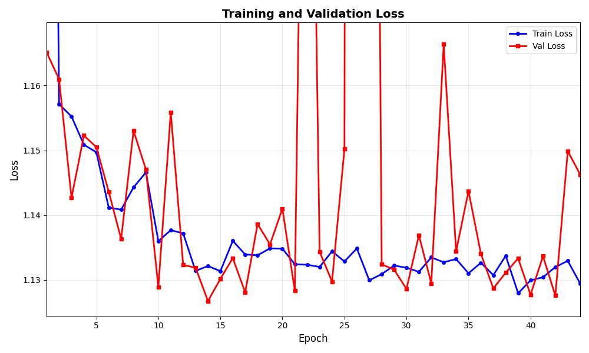
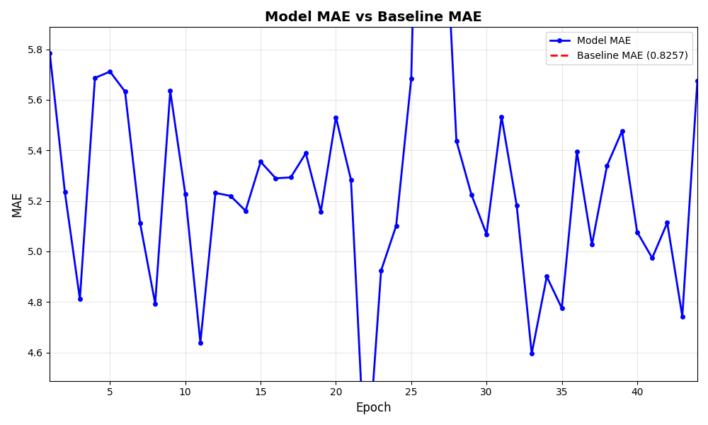

# Daily Diary - February 5, 2026

## Overview

Continued from Feb 2: **512×512 production runs** (be50f6df, 91cb07c8), same early-plateau pattern as 256. Documented **new features** added since last diary: 512 pipeline, ACL loss, per-epoch plots, run_id/plot path at start, prediction-tile fallback and tile_size fix for viz, UTF-8 config.

---

## Runs since 2026-02-02

### be50f6df1a1b449eb5bd6d887d4a4664 (512, combined)

| Field | Value |
|--------|--------|
| **Run ID** | `be50f6df1a1b449eb5bd6d887d4a4664` |
| **Mode** | production |
| **Tile size** | 512 |
| **Epochs** | 300 |
| **Loss** | combined |
| **Best val loss** | **2.29** (around epoch 26) |
| **Best val MAE** | **1.25** |
| **Best val IoU** | **0.0** |
| **Baseline MAE** | 0.826 |
| **Improvement over baseline** | Negative (val MAE > baseline) |

Val loss plateaus early; train loss keeps decreasing. Same overfitting pattern as 256 run ea6479a3.

### 91cb07c844294fc68c1b3ab261767f8c (512, ACL)

| Field | Value |
|--------|--------|
| **Run ID** | `91cb07c844294fc68c1b3ab261767f8c` |
| **Mode** | production |
| **Tile size** | 512 |
| **Epochs** | 300 |
| **Loss** | **ACL** (λ·Dice + (1−λ)·Focal), default λ=0.5 |
| **Best val loss** | **1.127** (at epoch **14**) |
| **Best val MAE** | 5.16 |
| **Best val IoU** | **0.083** |
| **Baseline MAE** | 0.826 |
| **Improvement over baseline** | Negative |

Best val **loss** at epoch 14; afterwards val loss oscillates, no sustained gain. Same “early plateau then overfitting” as 256 and as be50f6df. ACL loss scale differs from combined, so val MAE is not directly comparable; val MAE still worse than baseline.

**Note:** Both 512 runs had **no prediction_tiles in artifacts** at log time. Cause: `create_prediction_tile_figures` used `TileDataset` with default `tile_size=256`; 512×512 tiles failed the size assert and were skipped. Fixed by passing `tile_size` into the viz function and into `TileDataset`; future 512 runs will log example tiles (and fallback uses first N tiles when configured IDs do not match).

### Illustrations

Run **91cb07c8** (512, ACL): train vs val loss — best val loss at epoch 14, then plateau while train keeps decreasing.

MAE vs baseline: model val MAE stays above baseline throughout.

---

## New features (since Feb 2)

1. **512×512 tiles**
   - Config: `data.tile_size: 256 | 512`; path blocks `dev`, `dev_512`, `production`, `production_512` for filtered_tiles, features_dir, targets_dir.
   - Pipeline: `prepare_training_data.py --tile-size 256|512`; separate outputs (e.g. `train_512/`, `filtered_tiles.json` with optional `tile_size`).
   - Dataloader, train_model, tune: use `tile_size` and path_key from mode + tile_size.
   - Tile registry / shapefile: `create_tile_registry.py`, `TileRegistry`, `generate_tile_index_shapefile.py --tile-size 512`; config has `representative_tile_ids_512` and `representative_tile_ids_dev_512`.
   - Workflow: `docs/workflow_512_tiles.md`.

2. **ACL loss (default in config)**
   - `ACLLoss` in `src/models/losses.py`: λ·Dice + (1−λ)·Focal; config `loss_function: "acl"`, `acl_lambda: 0.5`.
   - Documented in `docs/loss_functions.md`.

3. **Monitoring and startup**
   - **Per-epoch plots:** After each epoch (non-Optuna), training plots (loss, MAE comparison, improvement %, IoU) are recreated and logged to `plots/*.png`, so MLflow artifacts update every epoch.
   - **Startup:** Right after `mlflow.start_run()`, script prints `[MLFLOW][START] experiment_id=... run_id=... run_name=...` and (for file: tracking) the plot path e.g. `.../artifacts/plots/loss.png` so the run can be followed live.

4. **Prediction tile visualization**
   - **Fallback:** If configured representative_tile_ids (for the current tile_size/mode) match no tiles, the code uses the **first N tiles** from the dataset (`prediction_tiles_fallback_n`, default 5) so some prediction figures are always logged when there are tiles.
   - **Tile-size fix:** `create_prediction_tile_figures` now takes `tile_size` and passes it to `TileDataset`, so 512 runs produce and log `prediction_tiles/*.png` instead of silently skipping all tiles.

5. **Config and encoding**
   - All YAML loads use `encoding="utf-8"` (training_config.yaml, best_hyperparameters.yaml), fixing Windows `UnicodeDecodeError` (e.g. byte 0x88 at position 1830).

---

## Documentation created / updated

- **This entry:** Runs be50f6df and 91cb07c8; new features (512, ACL, plots, run_id/plot path, prediction fallback + tile_size, UTF-8).
- **Plots copied:** `docs/daily_diary/plots/2026-02-05_run_91cb07c8_loss.png`, `2026-02-05_run_91cb07c8_mae_comparison.png`.

---

## Conclusion

512 production runs **be50f6df** (combined) and **91cb07c8** (ACL) show the **same early-plateau behavior** as 256: best val loss early (epoch 14–26), then overfitting. Val MAE remains worse than baseline. New tooling (512 pipeline, ACL, per-epoch plots, run_id at start, prediction-tile fallback and tile_size in viz, UTF-8 config) is in place; next 512 runs will again log example prediction tiles in MLflow artifacts.
