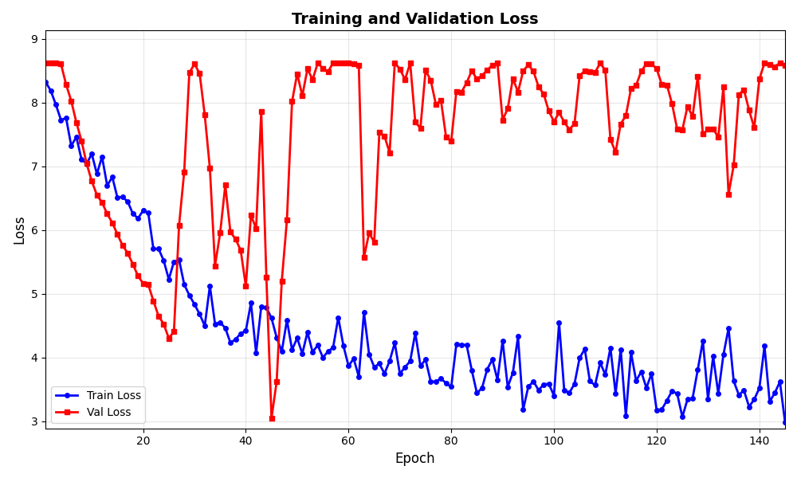

# Daily Diary - Monday 16 February 2026

## Val loss fluctuation investigation and config fixes

### What we saw

On synthetic parenthesis runs (e.g. MLflow run `a08ec8b381384feb917d13ae71574f35`), **validation loss** went down nicely until around epoch 25, then started to **fluctuate sharply** (e.g. 4.3 → 6.0 → 8.4 → 5.9). Train loss kept improving while val loss spiked and dropped repeatedly. That made it unclear when to stop and which checkpoint to trust.

### Investigations and causes

1. **Very few validation tiles**
   With `--max-tiles 50` and `val_split: 0.15`, we only had **about 4 validation tiles**. Val loss is the average over those 4 tiles, so a single "hard" or "easy" tile can move the metric a lot. High variance is expected.

2. **First big spike before any LR change**
   The first large val spike (around epochs 26–30) happened **before** ReduceLROnPlateau reduced the learning rate. So the instability was not primarily caused by the scheduler.

3. **Unfrozen encoder + learning rate**
   With `freeze_encoder: false` and `unfreeze_after_epoch: 0`, the encoder is trained from the start. A relatively high LR (e.g. 1e-5) can produce larger parameter updates; combined with a tiny val set, that can amplify val loss spikes.

4. **Overfitting and noise**
   After ~25 epochs the model fits the training set better. With only 4 val tiles, the val metric becomes very sensitive to which tiles are in the val set and how the model generalizes to each. The result is a noisy, "sawtooth" val curve.

### Config changes (synthetic parenthesis)

In **`configs/training_config_synthetic_parenthesis.yaml`** we applied:

- **`learning_rate: 0.000005`** (5e-6) — lower than 1e-5 to reduce step size with the unfrozen encoder and dampen val spikes.
- **`early_stopping_patience: 20`** — stop sooner and keep the best checkpoint (often in the 20–30 epoch range) instead of continuing through long fluctuation.
- **Comment on `val_split`** — noted that with `--max-tiles 50` there are only a few val tiles and val loss is noisy; suggested more tiles or a higher val fraction for more stable val metrics.

No code outside this config was changed. Earlier fixes (frozen encoder → val predictions all 0; `lr_scheduler_min_lr` > initial LR → LR jump and oscillation) were already in place from previous sessions.

### Illustration

Val loss (red) decreasing until ~epoch 25, then fluctuating strongly; train loss (blue) keeps improving. Run `a08ec8b381384feb917d13ae71574f35`, artifacts: `mlruns/.../artifacts/plots/loss.png`.

---

## Later (same day): Baseline U-Net ablation, spike debug, synthetic 256

### Baseline U-Net (no pretrained encoder)

To remove the pretrained-encoder variable and see if training is more stable and can reach loss < 1:

- **`configs/training_config_synthetic_parenthesis_unet.yaml`** — same pipeline as synthetic parenthesis but `architecture: "unet"` (from scratch), `learning_rate: 0.0001`, `early_stopping_patience: 40`.
- **Pipeline** — `run_synthetic_parenthesis_pipeline.sh` accepts **`--config PATH`**; use `--config configs/training_config_synthetic_parenthesis_unet.yaml` for the U-Net run.
- No code changes in model loading; path key and config already support the unet architecture.

### Val spike debugging (added, then removed)

- **`validate()`** in `src/training/trainer.py` was given an optional **`return_batch_losses`** and a fourth return value: list of per-batch val losses, to see which batch drives a spike when val_loss ≥ 6.5.
- **train_model.py** briefly logged these on spike (MLflow metrics + JSON artifact). On Windows this hit **OSError** (artifact path) and **PermissionError** (file in use when logging artifact). The spike-debug logging was **removed** to avoid the hassle; the trainer still supports `return_batch_losses` for future use.
- Investigation conclusion from run metrics: on spike epochs **val_pred_mean** collapses toward zero (e.g. 0.07, 0.0016), so the model sometimes outputs near-zero on validation; likely BatchNorm eval / few val tiles.

### Synthetic dataset on 256×256 tiles

- **Path key** (`config_utils.get_training_path_key`): for `synthetic_parenthesis`, returns `synthetic_parenthesis_256` or `synthetic_parenthesis_512` from `tile_size`.
- **Configs**: added **`paths.synthetic_parenthesis_256`** (features/targets/filtered_tiles under `synthetic_parenthesis_256/`) in both synthetic configs.
- **train_model.py**: synthetic mode no longer forces `tile_size = 512`; uses config (or `--tile-size` override).
- **Pipeline** **`--tile-size 256|512`** (default 512): with 256, uses dev/train or train (256) as source, writes to `synthetic_parenthesis_256`, runs training with `--tile-size 256`.
- **Run 256:** `bash pipelines/run_synthetic_parenthesis_pipeline.sh --tile-size 256 --source dev` (requires 256 source tiles).

### Observation: 256×256 vs 512×512 — no val loss craziness at 256

On **synthetic 256×256** (same pretrained `satlaspretrain_unet`, same pipeline), validation loss stays **stable** for 80+ epochs: smooth decrease, no spikes, no val_pred_mean collapse. Example run **`32580a5d95354710b2593f99eb1b07d6`**: val_loss from ~20.6 down to ~17.8, val_pred_mean from ~0.08 up to ~0.58 over 79 epochs; 9 val tiles. On **512×512** we repeatedly saw val loss spike (e.g. 4.2 → 8.4) and val_pred_mean collapse toward zero from around epoch 17–26 onward. So the instability (BatchNorm eval / distribution mismatch?) appears **tile-size dependent**: fine at 256, problematic at 512. Worth keeping 256 as an option for stable sanity-check or ablation.

### Endday

- Diary entry for Monday 16 February 2026 (endday run Tuesday 17 Feb).
- E2E tests: run attempted; one test failed (inspect locally with `pytest tests/e2e -m e2e -v` if needed).
- Changes pushed.
