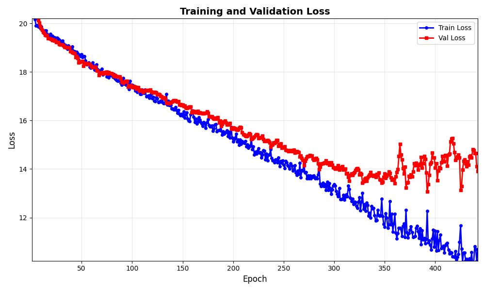
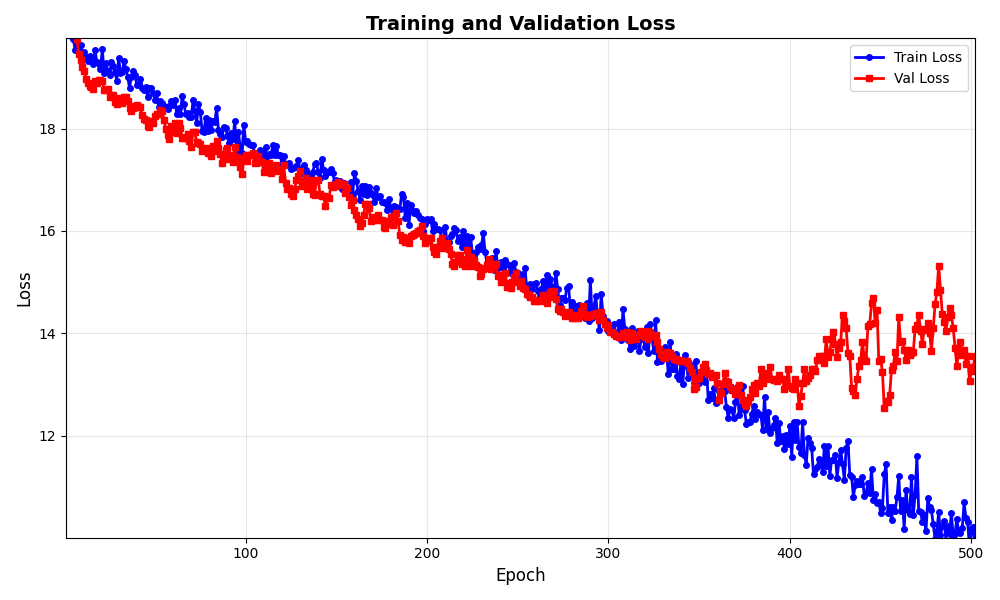
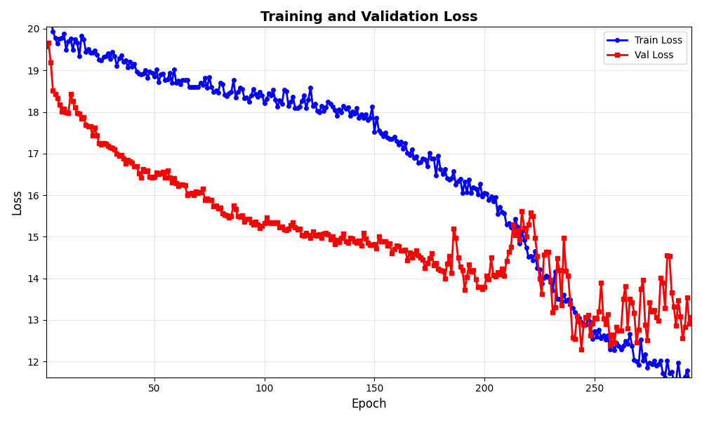
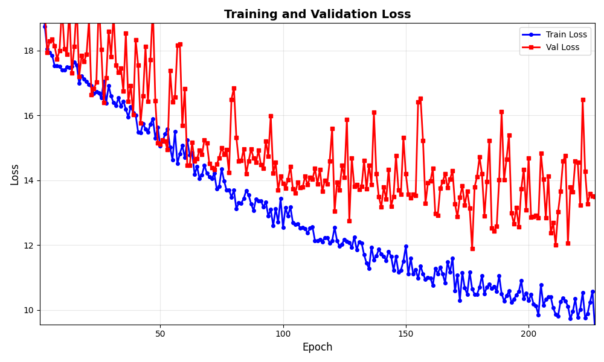
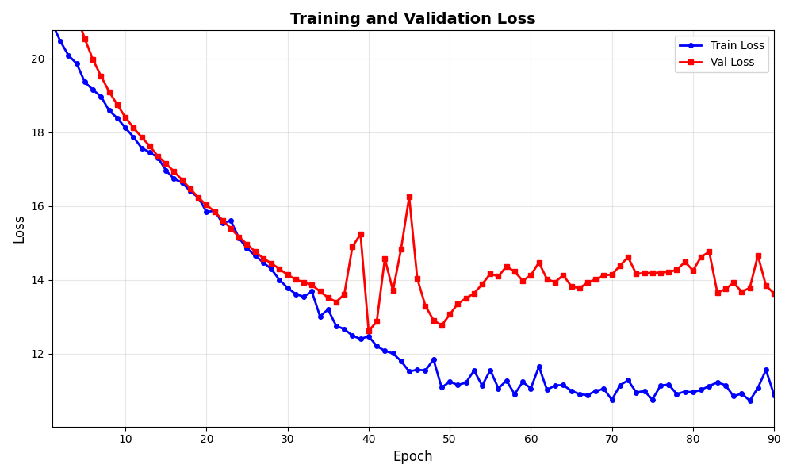

# Daily Diary - Tuesday 17 February 2026

## Voice notification when training finishes

### What we added

A **voice message** when training completes (normal runs only, not Optuna trials): it speaks how long training took (hours and minutes) and how many epochs were run.

- **Dependencies:** `gtts` and `pygame` added to `pyproject.toml` (gTTS for text-to-speech, pygame for playback).
- **New module:** `src/utils/voice_notify.py`
  - `notify_training_finished(elapsed_seconds, epochs_run)` builds a short English sentence (e.g. “Training finished. It took 2 hours and 15 minutes. 40 epochs were run.”), generates an MP3 via gTTS, plays it with pygame.mixer, then deletes the temp file.
  - If `gtts` or `pygame` is missing, logs a warning and returns without failing.
- **Integration in `scripts/train_model.py`:**
  - `training_start_time = time.time()` before the epoch loop.
  - After the loop, when `trial is None`, calls `notify_training_finished(time.time() - training_start_time, epoch)` so duration and actual epochs run (including early stop) are reported.

### Poetry install / workaround

Running `poetry install` after adding gtts and pygame failed: the lock file pins `torch 2.1.2`, which has no compatible Windows wheels for this environment, so Poetry tried to downgrade torch and failed. **Workaround:** install only the new deps into the existing venv with `poetry run pip install gtts pygame`. Voice notification works; lock file was left as-is to avoid touching torch. To fix the lock file later: `poetry lock --no-cache` then `poetry install` (may update other deps).

---

## Model runs (since last diary)

Recent MLflow runs (experiment `586083506121040615`) from Feb 16–17:

| Run ID (short) | Run name | Notes |
|----------------|----------|--------|
| `e80bb3c8` | unet_baseline_synthetic_parenthesis | Started recently; may still be running (end_time null). |
| `f7bb7174` | unet_baseline_synthetic_parenthesis | Finished; best_val_loss ≈ 12.61. Artifacts: `mlruns/.../f7bb7174.../artifacts/plots/loss.png`, `best_predicted_tile.png`, `best_iou_tile.png`. |
| `a54030db` | unet_baseline_synthetic_parenthesis | Finished. |
| `52fd23bee` | unet_baseline_synthetic_parenthesis | Finished. |

These are **synthetic parenthesis** pipeline runs (e.g. `run_synthetic_parenthesis_pipeline.sh --tile-size 256 --source prod --max-tiles 128`), baseline U-Net from scratch as in the Feb 16 diary.

---

## Common pattern: loss declining then unstable

Across today’s runs, **validation loss** (and often train loss) decreased steadily for a number of epochs, then became **unstable**: larger swings, spikes, or a “sawtooth” shape. Train loss sometimes kept improving while val loss oscillated. This matches the pattern already seen on Feb 14–16 with synthetic parenthesis (e.g. val loss spike / val_pred_mean collapse).

### Parameters that differ between today’s runs

All runs: `mode=synthetic_parenthesis`, `data.tile_size=256`, `training.learning_rate=5e-06`, `training.loss_function=acl`, `model.architecture=satlaspretrain_unet`, `data.train_subsample_ratio=1.0`, `training.early_stopping_patience=50`. Differences:

| Run ID (short) | num_train | num_val | batch_size | encoder_unfreeze_epoch | iou_threshold | decoder_dropout |
|----------------|-----------|---------|------------|------------------------|---------------|------------------|
| c7224a7b       | 44        | 9       | 16         | 5                      | 1.0           | 0.2              |
| cf86306b      | 44        | 9       | 16         | 5                      | 5.0           | 0.2              |
| 52fd23bee     | 89        | 19      | 16         | 5                      | 5.0           | 0.2              |
| a54030db      | 89        | 19      | 8          | 5                      | 5.0           | 0.2              |
| f7bb7174      | 89        | 19      | 24         | 50                     | 5.0           | 0.3              |

So the main varying levers were: **dataset size** (44 vs 89 train tiles, 9 vs 19 val), **batch_size** (8, 16, 24), **encoder_unfreeze_epoch** (5 vs 50), **iou_threshold** (1.0 vs 5.0), and **decoder_dropout** (0.2 vs 0.3).

### Loss curves (all five runs)

### Comment and hypothesis

- **Observation:** The “decline then instability” pattern appears in all five runs despite different train/val sizes, batch size, unfreeze epoch, and iou_threshold. So it is **not** explained by a single parameter; it’s a recurring behaviour under this setup.

- **Hypothesis (concatenation of earlier and current ideas):**
  1. **Small validation set:** With 9 or 19 val tiles, val loss is the mean over few tiles. One or two “hard” or “easy” tiles can move the metric a lot, so val loss is high-variance and can spike or drop without the model changing much.
  2. **Encoder unfreezing and LR:** When the encoder unfreezes (epoch 5 or 50), the effective learning rate and capacity change. If the decoder was already fitting the small train set well, unfreezing can shift the solution in a way that temporarily hurts val (or make BatchNorm stats noisier on a tiny val set).
  3. **BatchNorm in eval:** With few val tiles and small batch size, BatchNorm running stats at eval may not match the training distribution well; that can produce occasional very low or high val predictions (e.g. val_pred_mean collapse toward zero on spike epochs, as noted Feb 16).
  4. **Overfitting + noisy val:** After the initial descent, the model fits the training data better. With a small, fixed val set, the val metric becomes very sensitive to which val tiles are “in favour” that epoch, so we see a noisy or sawtooth val curve even if the best checkpoint (early stopping) is still reasonable.

So the instability is likely a **combination of small val set variance, BatchNorm eval behaviour, and encoder-unfreeze / capacity changes**, rather than one single hyperparameter. Next steps could be: increase val tiles or val fraction for more stable metrics; try freezing the encoder longer or using a smaller LR after unfreeze; or accept the noise and rely on early stopping + best checkpoint.

---

## Binary mode and BCE – first sensible run

### What is BCE (Binary Cross-Entropy)?

**BCE** is the standard loss for binary targets (0 or 1). For each pixel:

- **Target 1 (lobe):** loss is high when the model predicts near 0, and goes to 0 when the prediction is near 1.
- **Target 0 (background):** loss is high when the model predicts near 1, and goes to 0 when it predicts near 0.

So the model is pushed to output **≈ 1** where there is lobe and **≈ 0** where there is background. BCE is **≥ 0**; lower is better. A value around **0.69** (−ln(0.5)) corresponds to random guessing (predicting 0.5 everywhere); values well below 0.5 indicate the model is doing better than random.

### Binary mode and first sensible BCE run

We added a **switchable target mode**: **proximity** (0–20 regression) vs **binary** (0/1 lobe vs background). For the synthetic parenthesis setup we set `target_mode: "binary"` and `loss_function: "bce"` in `configs/training_config_synthetic_parenthesis.yaml`.

**Run `f2d855dd705c4ed49b955231f955d7d0`** was the **first sensible run with BCE**: training and validation loss both decreased steadily (from ~0.63 down to ~0.42–0.43 over ~105 epochs), with validation loss tracking close to or slightly below training loss. No large spikes or instability; the curve looks like a normal, well-behaved learning run.

Best-tile plots (best_predicted_tile, best_iou_tile) for this run use the 0–1 scale.

- **Conclusion so far:** Binary mode looks promising and the BCE loss function gave nice results. We have to wait with the final conclusion for a **night run** of the model (longer training / more epochs) to see if the trend holds and how low the loss can go.

---

## Summary

- **Conversation / edits:** Voice notification on training completion (gtts, pygame, `voice_notify.py`, integration in `train_model.py`). Poetry install failure and pip workaround for the two new packages. Later: switchable target mode (proximity vs binary), BCE loss, visualization scale 0–1 for binary.
- **Conclusions:** Voice notify is optional (graceful fallback if deps missing); only used for full training runs, not Optuna trials. Binary mode + BCE gave the first sensible, stable loss curve (run f2d855dd705c4ed49b955231f955d7d0); awaiting a night run before final conclusion.
- **Experiments:** Synthetic parenthesis runs with binary target and BCE; run f2d855dd as first sensible BCE run.

---

## Endday

- Diary entry for Tuesday 17 February 2026.
- **Binary mode + BCE:** First sensible run (f2d855dd705c4ed49b955231f955d7d0); binary mode looks promising, BCE gave nice results. Conclusion deferred until after a night run of the model.
- **Diary convention:** In daily diary entries, display images with markdown `` instead of only writing plain file paths; that way plots and screenshots are visible in the doc.
- E2E tests: run with `pytest tests/e2e/ -m e2e -v` (can take several minutes; one test runs 1-epoch training). If dev data is missing, tests are skipped.
- Changes pushed (voice notification, target_mode/binary/BCE, visualization 0–1 scale, diary, pyproject).
