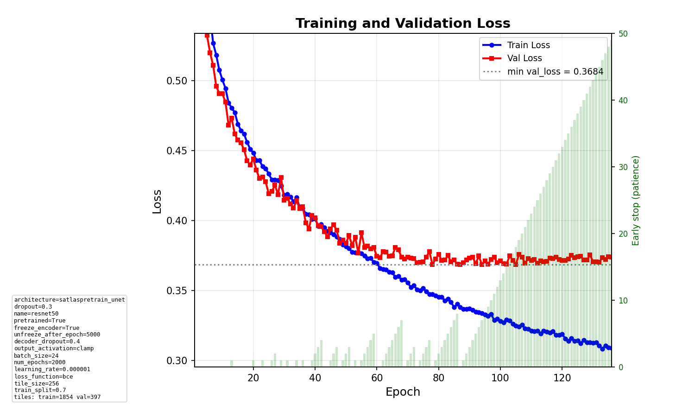
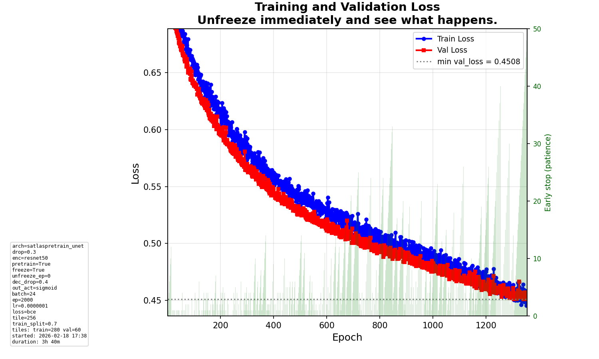

# Daily Diary - Wednesday 18 February 2026

## Run intention prompt and smart suggestion

### What we added

Before each **non-Optuna** training run, the script now prompts for a **run intention** (subtitle for the loss plot). The intention is shown only as a **subtitle** under the main title “Training and Validation Loss” (no longer in the bottom config text box).

- **Prompt flow:** After “=== Starting Training ===”, the script prints a **suggestion** line, then asks: `Run intention (subtitle): `.
- **Suggestion:** `get_intention_suggestion(experiment_id, current_run_id)` in `src/utils/mlflow_utils.py`:
  - Loads the current run’s params (already logged).
  - Finds the most recently **finished** run in the same experiment (order by `attributes.end_time DESC`), excluding the current run.
  - Diffs all params and builds a one-line suggestion, e.g.
    `Changes vs last run: lr 1e-06→1e-07, loss mse→bce, out_act softmax→sigmoid`.
  - Uses short display names (e.g. `learning_rate` → `lr`, `loss_function` → `loss`, `output_activation` → `out_act`).
  - If no previous run: `No previous run to compare.` If no diffs: `No changes vs last run.`
- **Usage:** You can type your own subtitle (or leave empty) based on the suggestion.
- **Regenerating loss plots with intention:**
  `poetry run python scripts/plot_loss_from_mlflow_run.py --run-id <RUN_ID> --intention "your text" [--output path/to/loss.png]`
  Writes the intention as subtitle only (not in the text box).

### Code touched

- `scripts/train_model.py`: intention prompt only when `trial is None`; call `get_intention_suggestion()` and print suggestion before `input("Run intention (subtitle): ")`.
- `src/utils/mlflow_utils.py`: `get_intention_suggestion()`, `_short_param_key()`, `_PARAM_DISPLAY_NAMES`.
- `src/training/visualization.py`: `plot_loss(..., run_intention=...)` — subtitle under main title; intention **removed** from info box.
- `scripts/plot_loss_from_mlflow_run.py`: `--intention` argument and pass `run_intention` into `plot_loss()`.

**E2E / non-interactive:** Suggestion uses ASCII `->` instead of Unicode `→` so it prints on Windows (cp1250). Intention prompt wraps `input()` in `try/except EOFError` so non-interactive runs (e.g. pytest e2e) get `run_intention = None` and do not hang.

---

## Model runs (since last diary)

Recent MLflow runs (experiment `586083506121040615`) from Feb 17–18 (UTC). All are **synthetic parenthesis**, **binary** target, **tile_size=256**, **batch_size=24**. Loss type: **BCE** (binary cross-entropy) for all.

| Run ID (short) | End time (UTC) | lr         | output_activation | Loss | best val loss | num_train | num_val | Notes |
|----------------|----------------|------------|-------------------|------|----------------|----------|---------|--------|
| `5626ddf7`     | Feb 18 01:15   | 0.000001   | clamp             | BCE  | **0.368**      | 1854     | 397     | **Best run.** Earlier run. |
| `c08d3ae7`     | Feb 18 07:40   | 0.0000001  | clamp             | BCE  | 0.738          | 1854     | 397     | LR lowered; only 1 epoch logged. |
| `416a9b4b`     | Feb 18 16:17   | 0.0000001  | sigmoid           | BCE  | 0.369          | 1854     | 397     | Switched to sigmoid; full tile set. |
| `aee9a3e2`     | Feb 18 16:34   | 0.0000001  | sigmoid           | BCE  | —              | 280      | 60      | Smaller dataset (280/60); no best_val_loss logged. |
| `70a6e8af`     | Feb 18 20:19   | 0.0000001  | sigmoid           | BCE  | 0.451          | 280      | 60      | Same config as aee9a3e2; most recent. |

**Parameters we tinkered with:** learning rate (1e-6 → 1e-7), output_activation (clamp → sigmoid), and dataset size (full 1854/397 vs subset 280/60). Intention prompt and suggestion were used to document these changes in the loss plot subtitle.

### Best run (5626ddf7) — illustrations

- **best val loss:** 0.368
- **best val IoU:** 0.041 (threshold 0.5)
- **Config:** lr 0.000001, clamp output, BCE, 1854 train / 397 val tiles.

**Loss (training and validation):**

*(IoU-over-epoch and best-tile figures were not saved for this run; only metrics and regenerated loss plot are available.)*

### Example: most recent run (70a6e8af)

- **best_val_loss** ≈ 0.451, **best_val_iou** ≈ 0.051.
- Artifacts: `mlruns/586083506121040615/70a6e8af1fb54ce48498a5a1cf70385c/artifacts/plots/loss.png` (and other plots).

---

## Summary

- **Conversation / edits:** Run intention prompt before training; smart suggestion by diffing current config vs last run; intention as subtitle only (removed from text box); `plot_loss_from_mlflow_run.py --intention` to regenerate loss charts with a custom subtitle.
- **Conclusions:** Suggestion makes it easier to decide what to write for the subtitle. Subtitle-only keeps the config box uncluttered.
- **Experiments:** Continued binary + BCE + sigmoid runs; varied lr (1e-7), output_activation (sigmoid vs clamp), and train/val size (280/60 vs 1854/397).

---

## Endday

- Diary entry for **Wednesday 18 February 2026**.
- E2E tests: run with `pytest tests/e2e/ -m e2e -v`. If dev data is missing, tests are skipped.
- Changes pushed.
