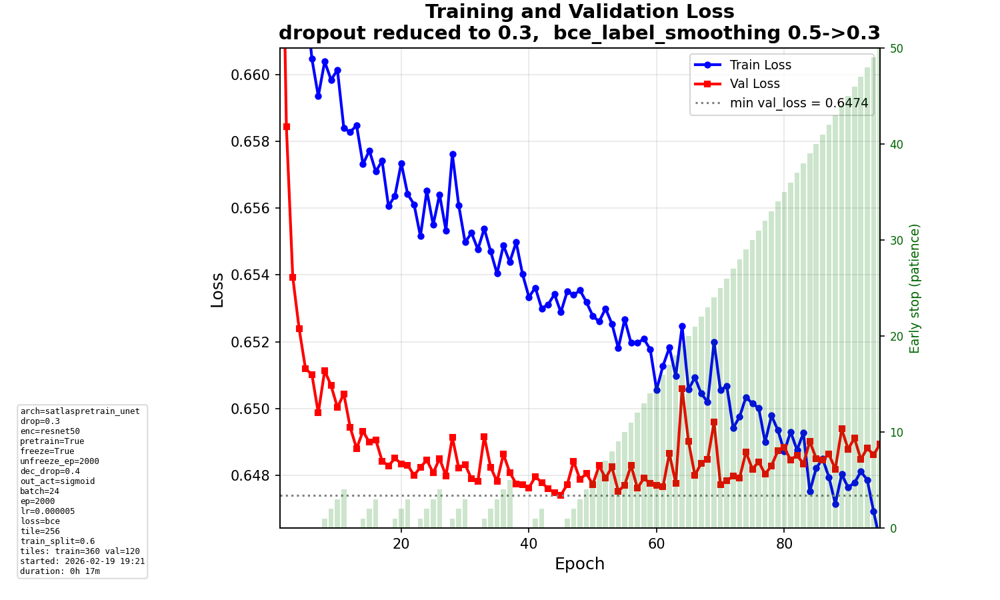

# Daily Diary - Thursday 19 February 2026

## User-friendly MLflow run names

### What we added

MLflow run IDs are opaque (e.g. `3237251b51fa4b27bcd882608da6f927`). We now set a **readable run_name** by default so the UI and exports show what each run is.

- **Format:** `YYYY-MM-DD-HH-MM-SS_architecture_loss`  
  Example: `2026-02-19-18-39-00_satlaspretrain_unet_bce`
- **Optuna runs:** Trial suffix appended for uniqueness: `..._bce_t003`
- **Implementation:**
  - `src/utils/mlflow_utils.py`: `build_user_friendly_run_id(config, trial=None)` builds the string from timestamp, `model.architecture`, and `training.loss_function`; `_sanitize_run_id_part()` keeps path-safe characters only.
  - `scripts/train_model.py`: If `run_name is None`, we set `run_name = build_user_friendly_run_id(config, trial=trial)` and call `mlflow.start_run(run_name=run_name)`. The actual **run_id** remains MLflow-generated (required for new-run creation in this MLflow version).
- **Uniqueness:** Timestamp includes seconds; Optuna runs add `_t{N}`. Run names can repeat; only run_id is unique.
- **Experiment id** is still the numeric id MLflow assigns from the experiment name.

### Code touched

- `src/utils/mlflow_utils.py`: `build_user_friendly_run_id()`, `_sanitize_run_id_part()`, imports `re`, `datetime`.
- `scripts/train_model.py`: Import `build_user_friendly_run_id`; when `run_name is None`, set `run_name` to the friendly string and pass it to `mlflow.start_run(run_name=run_name)`.

---

## Model runs (since last diary)

Recent MLflow runs (experiment `586083506121040615`) from Feb 18–19 (UTC). All are **synthetic parenthesis**, **binary** target, **satlaspretrain_unet**, **BCE**, **sigmoid** output.

### Feb 19 runs (today)

| Run ID (short) | End time (UTC) | lr     | train_subsample | num_train | num_val | best val loss | Notes |
|----------------|----------------|--------|-----------------|-----------|---------|----------------|--------|
| `ded2f6ff`     | Feb 19 17:53   | 5e-6   | 1.0             | 240       | 80      | **0.391**      | Best of the day. |
| `bf9a26d3`     | Feb 19 18:17   | 5e-6   | —               | 240       | 80      | 0.694          | Same data size. |
| `3237251b`     | Feb 19 18:39   | 5e-6   | 0.8             | 360       | 120     | 0.647          | 80% subsample; more tiles. |

**Parameters we tinkered with:** `data.train_subsample_ratio` (1.0 vs 0.8) and train/val sizes (240/80 vs 360/120). Architecture, loss, and lr were fixed (satlaspretrain_unet, BCE, sigmoid, 5e-6).

### Illustration (most recent run 3237251b)

- **best_val_loss** ≈ 0.647, lr 5e-6, 360 train / 120 val, subsample 0.8.

---

## Summary

- **Conversation / edits:** User-friendly MLflow run_id (timestamp + architecture + loss); default run_name = run_id; Optuna runs get `_t{N}` suffix.
- **Conclusions:** Run names like `2026-02-19-18-39-00_satlaspretrain_unet_bce` make it easier to spot what each run is in the MLflow UI and in exports (run_id stays auto-generated).
- **Experiments:** Continued synthetic parenthesis runs with same arch/loss/lr; varied subsample and train/val sizes; best val loss 0.39 (run ded2f6ff).

---

## Endday

- Diary entry for **Thursday 19 February 2026**.
- E2E tests: run with `pytest tests/e2e/ -m e2e -v`. If dev data is missing, tests are skipped.
- Changes pushed.
