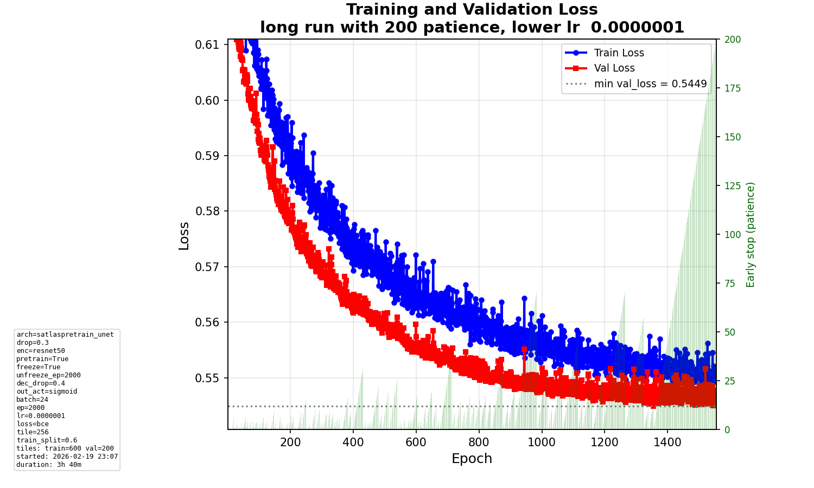
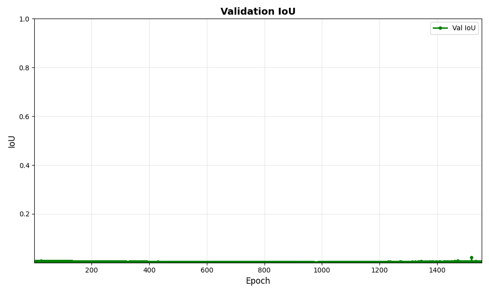
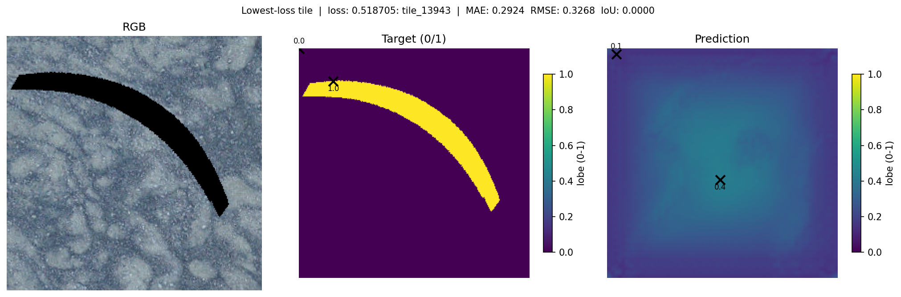
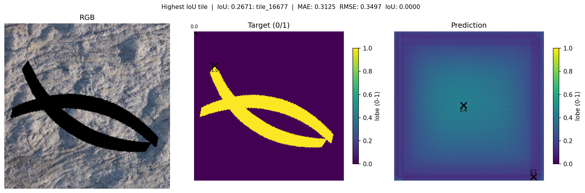
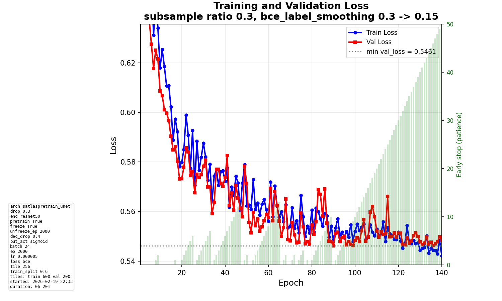

# Daily Diary - Thursday 19 February 2026

## User-friendly MLflow run names

### What we added

MLflow run IDs are opaque (e.g. `3237251b51fa4b27bcd882608da6f927`). We now set a **readable run_name** by default so the UI and exports show what each run is.

- **Format:** `YYYY-MM-DD-HH-MM-SS_architecture_loss`
  Example: `2026-02-19-18-39-00_satlaspretrain_unet_bce`
- **Optuna runs:** Trial suffix appended for uniqueness: `..._bce_t003`
- **Implementation:**
  - `src/utils/mlflow_utils.py`: `build_user_friendly_run_id(config, trial=None)` builds the string from timestamp, `model.architecture`, and `training.loss_function`; `_sanitize_run_id_part()` keeps path-safe characters only.
  - `scripts/train_model.py`: If `run_name is None`, we set `run_name = build_user_friendly_run_id(config, trial=trial)` and call `mlflow.start_run(run_name=run_name)`. The actual **run_id** remains MLflow-generated (required for new-run creation in this MLflow version).
- **Uniqueness:** Timestamp includes seconds; Optuna runs add `_t{N}`. Run names can repeat; only run_id is unique.
- **Experiment id** is still the numeric id MLflow assigns from the experiment name.

### Code touched

- `src/utils/mlflow_utils.py`: `build_user_friendly_run_id()`, `_sanitize_run_id_part()`, imports `re`, `datetime`.
- `scripts/train_model.py`: Import `build_user_friendly_run_id`; when `run_name is None`, set `run_name` to the friendly string and pass it to `mlflow.start_run(run_name=run_name)`.

---

## Model runs (since last diary)

Recent MLflow runs (experiment `586083506121040615`) from Feb 18–19 (UTC). All are **synthetic parenthesis**, **binary** target, **satlaspretrain_unet**, **BCE**, **sigmoid** output.

### Feb 19 runs (today)

| Run ID (short) | End time (UTC) | lr     | train_subsample | num_train | num_val | best val loss | Notes |
|----------------|----------------|--------|-----------------|-----------|---------|----------------|--------|
| `ded2f6ff`     | Feb 19 17:53   | 5e-6   | 1.0             | 240       | 80      | **0.391**      | Best of the day. |
| `bf9a26d3`     | Feb 19 18:17   | 5e-6   | —               | 240       | 80      | 0.694          | Same data size. |
| `3237251b`     | Feb 19 18:39   | 5e-6   | 0.8             | 360       | 120     | 0.647          | 80% subsample; more tiles. |

**Parameters we tinkered with:** `data.train_subsample_ratio` (1.0 vs 0.8) and train/val sizes (240/80 vs 360/120). Architecture, loss, and lr were fixed (satlaspretrain_unet, BCE, sigmoid, 5e-6).

### Illustration (most recent run 3237251b)

- **best_val_loss** ≈ 0.647, lr 5e-6, 360 train / 120 val, subsample 0.8.

---

## Subsampling + reduced LR + long patience (run 6be31cc1)

### Goal

We tried **subsampling** (30% of train tiles per epoch) to reduce overfitting. Results were a bit **unstable**, so we **reduced learning rate** (1e-7) and set **early-stopping patience to 200** to give a long run and see if we could get good results.

### Recent run: 6be31cc1

| Setting            | Value   |
|--------------------|--------|
| train_subsample    | 0.3     |
| learning_rate      | 1e-7    |
| early_stop patience| 200     |
| num_train / num_val| 600 / 200 |
| **best_val_loss**  | **0.5449** |
| **best_val_iou**   | **0.00165** |

Outcome: we did **not** get good results; val loss stayed around 0.54 and IoU remained very low.

### Comparison with previous run (d9edee3a)

|                    | Previous (d9edee3a) | Recent (6be31cc1) |
|--------------------|--------------------|-------------------|
| learning_rate      | 5e-6               | 1e-7              |
| early_stop patience| 50                 | 200               |
| train_subsample    | 0.3                | 0.3               |
| best_val_loss      | 0.546              | **0.5449** (slightly better) |
| best_val_iou       | **0.0072**         | 0.00165 (worse)   |

So with **lower lr and long patience** we got a tiny improvement in val loss but **worse IoU**; the previous run (higher lr, patience 50) had clearly better IoU (0.0072 vs 0.00165).

### Illustrations

**Run 6be31cc1 — loss (subsample 0.3, lr 1e-7, patience 200):**

**Run 6be31cc1 — IoU over epochs:**

**Run 6be31cc1 — best predicted tile and best IoU tile:**

**Previous run d9edee3a — loss (subsample 0.3, lr 5e-6, patience 50):**

---

## Summary

- **Conversation / edits:** User-friendly MLflow run_id (later reverted); subsampling + reduced lr + 200-epoch patience run and comparison with previous.
- **Conclusions:** Long patience + low lr did not improve outcomes; best_val_loss 0.5449 and best_val_iou 0.00165. Previous run (d9edee3a) with lr 5e-6 and patience 50 had better IoU (0.0072).
- **Experiments:** Subsampling 0.3, lr 1e-7, early_stop patience 200; compared with run d9edee3a (same subsample, lr 5e-6, patience 50).

---

## Endday

- Diary entry for **Thursday 19 February 2026**.
- E2E tests: run with `pytest tests/e2e/ -m e2e -v`. If dev data is missing, tests are skipped.
- Changes pushed.
