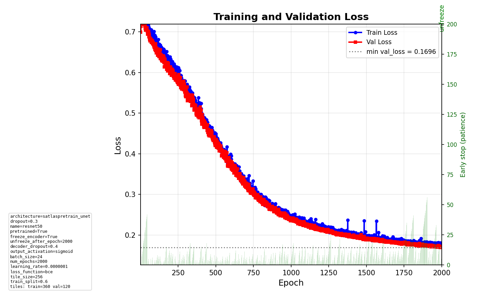
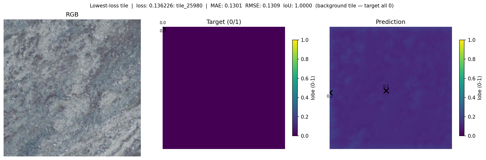
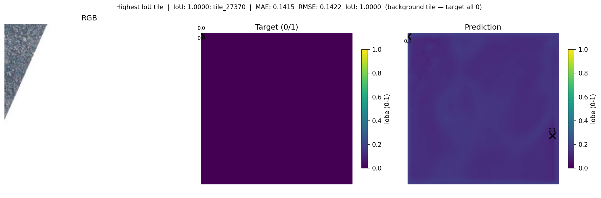

# Daily Diary - Saturday 21 February 2026

## Model runs (since last diary)

Runs in experiment `586083506121040615`. Last diary was 2026-02-20.

### Run of the day: best model so far

| Run ID (short) | End time (UTC) | lr    | segmentation | train_subsample | early_stop patience | num_train | num_val | best val loss | best val IoU | Notes |
|----------------|----------------|-------|---------------|-----------------|---------------------|-----------|---------|----------------|--------------|--------|
| **`809e839b`** | Feb 21         | 1e-7  | **true**      | 0.7             | 200                 | 360       | 120     | **0.1696**     | **~0.88**    | Synthetic parenthesis 256; BCE, sigmoid. 6th channel = segmentation layer. |

**Parameters:** `data.use_segmentation_layer: true` (6th input channel, Felzenszwalb segment IDs), `training.learning_rate: 1e-7`, `data.train_subsample_ratio: 0.7`, `training.early_stopping_patience: 200`, tile_size 256, binary target, satlaspretrain_unet.

### Comparison to recent days

- **Previous best val loss (synthetic parenthesis):** 0.368 (5626ddf7, Feb 18) and 0.391 (ded2f6ff, Feb 19). We were **never close** to 0.17 before.
- **This run (809e839b):** val_loss **0.1696** — by far the best so far. Val IoU ~0.88 at end of training (2000 epochs).
- **Attribution:** We believe the improvement is **due to the additional segmentation layer** (6th channel). The model had very **steady learning** and never got close to early-stop patience (200); training ran through the full 2000 epochs with no sign of needing to stop.

### Illustrations

**Loss (advanced style, regenerated)**

**Best predicted tile**

**Best IoU tile**

---

## Conclusions

- **Did we improve?** **Yes.** Val loss 0.1696 is the best we have seen; previous best was ~0.37. Val IoU ~0.88 is very strong on synthetic parenthesis.
- **Why?** The **segmentation layer** (optional 6th channel, OBIA-style segment IDs) gives the CNN boundary/region hints and is the main change vs earlier runs. Steady learning suggests the task became easier with this input.
- **Next:** Keep segmentation layer as default for synthetic experiments; consider same for production imagery once segmentation rasters are tiled. Backlog: stone-stripe / slope-aligned texture channel (docs/improvements_backlog.md §13).

---

## Conversation and edits

- **Loss plot:** Regenerated `loss.png` for run 809e839b using the **advanced visualization style** (min val line, early-stop bar, config summary, unfreeze marker) via `scripts/plot_loss_from_mlflow_run.py`.
- **Endday:** Diary entry for Saturday 21 February 2026; e2e tests run; README unchanged.

---

## Summary

- **Best run:** 809e839ba0634e588ecbeb800922e9b5 — val_loss **0.1696**, val IoU ~0.88. Synthetic parenthesis, 256 tiles, segmentation layer on, lr 1e-7, subsample 0.7, patience 200.
- **Cause of improvement:** Additional **segmentation layer** (6th channel). Very steady learning; never near early-stop.
- **E2E tests:** Run: `poetry run pytest tests/e2e -m e2e -v`. Minimal training test passed; full run includes tuning test (can be slow).
- **README:** No new commands or parameters; unchanged.

---

## Endday

- Diary entry for **Saturday 21 February 2026**.
- E2E tests run; README unchanged.
- Changes to be pushed.
