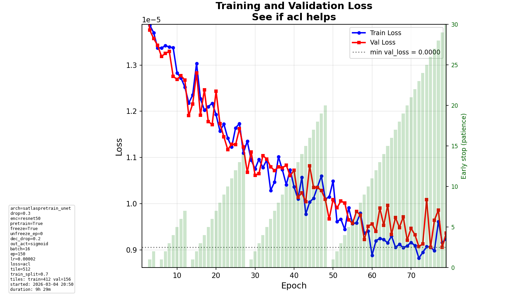
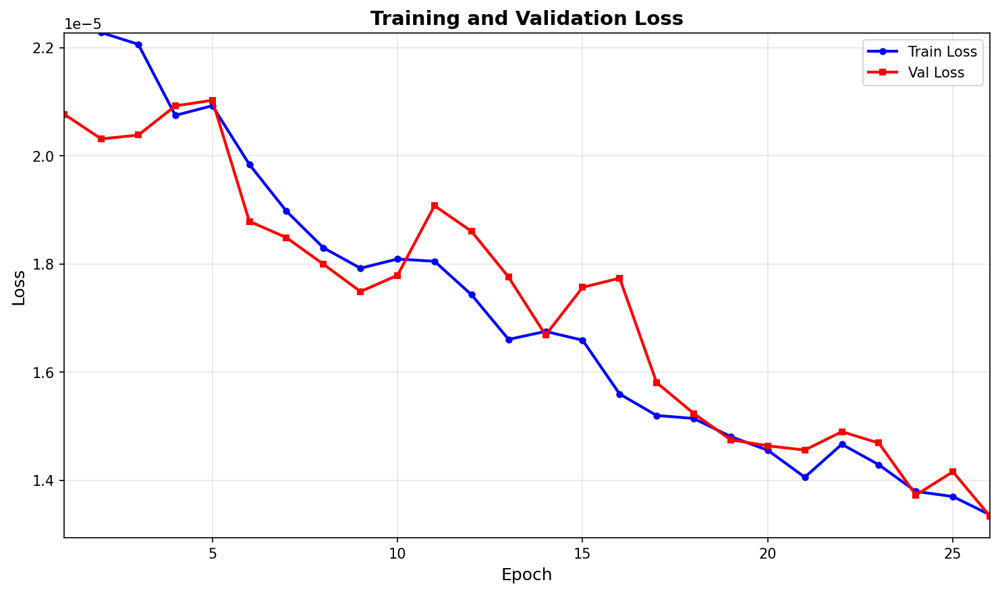

# Daily Diary - Thursday 05 March 2026

## Context

Current date: **2026-03-05**. Last diary: 2026-02-25 (production runs, best f8a087df val_loss 0.289; bac0c39d with --max-tiles 300 did not improve).

We are on the **real production dataset** (512×512, slope-stripes, segmentation). Recent work focused on **illumination (shadow/sun/mixed)** from a hand-drawn shadow mask, **early-stopping behaviour**, and **run intention** for diary use.

---

## Model runs (since 2026-02-25)

Experiment `586083506121040615`. Runs from 1–5 Mar:

| Run ID (short) | best val_loss | best val_mae | lr   | epochs | loss | early_stop | min_delta | notes |
|----------------|---------------|--------------|------|--------|------|------------|-----------|-------|
| **e66b5253**   | **9.06e-6**   | 0.377        | 2e-5 | 150    | acl  | 30         | 1e-6      | Mar 4 – ACL loss; early stopped at epoch 79 (val_loss no improvement ≥1e-6 for 30 epochs) |
| a307c8eb       | —             | —            | 2e-5 | 150    | acl  | 30         | —         | Mar 5 – run in progress (same config as e66b5253) |
| a2e502da       | —             | —            | —    | —      | bce  | —          | —         | Mar 1 – params present; metrics may be from different run or incomplete |

**Note on scale:** e66b5253 uses **ACL** loss (Dice + Focal); best_val_loss is on the order of 1e-5, so “9.06e-6” is the best validation loss. best_val_mae 0.377 is in proximity units.

**Best in this window:** **e66b5253** – ACL, lr 2e-5, 150 epochs, early_stop 30, min_delta 1e-6. Training stopped at epoch 79 because **validation loss** had not improved by at least 1e-6 since epoch 49 (patience 30). Training loss kept declining; early stopping is based on **val_loss**, not train loss.

### Parameter differences (what we tinkered with)

- **e66b5253 / a307c8eb:** Current `training_config.yaml`: **ACL** loss (acl_lambda 0.5), lr 2e-5, 150 epochs, early_stopping_patience 30, **early_stopping_min_delta 1e-6**. Binary target mode, sigmoid output, SatlasPretrain ResNet50 encoder.
- **Early stopping:** We clarified that early stop uses **val_loss** and **min_delta**; the loss plot now includes a note “Early stop: val_loss (improvement >= 1e-06)” so it’s clear why training can stop while the curve still looks “declining” (train loss).

### Loss chart – e66b5253 (early stop at 79)

Val loss best at epoch 49 (9.67e-6); no later epoch beat best − 1e-6, so patience counter reached 30 at epoch 79.

### Loss chart – a307c8eb (in progress)

---

## Conversations and code changes (since 2026-02-25)

### 1. Illumination: shadow-mask classification and shapefile

- **classify_tiles_by_shadow_mask.py** classifies tiles as **sun / shadow / mixed** from a hand-drawn **shadow mask** (`data/raw/vector/shadow_mask.shp`): polygons = shadow, outside = sun. Tile class = shadow if ≥70% of tile in shadow, sun if ≤30%, else **mixed** (configurable threshold, default 0.3).
- Script updates **tile_registry.json** and **filtered_tiles.json**; can write **illumination_tiles.shp** (and .qml) for QGIS. Shapefile uses short column name **illum** (≤10 chars) and QML uses it for styling.
- Config: `configs/data_preparation_config.yaml` → `illumination.shadow_mask`, `illumination.mixed_threshold`. Recommended over the previous HSV/centroid method.

### 2. Early stopping: why it triggered with “loss still declining”

- Early stopping is based on **validation loss**, not training loss. Criterion: `val_loss < best_so_far - min_delta` (min_delta = 1e-6 in this run).
- Run e66b5253: best val_loss at epoch 49 (9.67e-6). No later epoch had val_loss < 8.67e-6, so the “no improvement” counter increased every epoch from 50 and reached 30 at epoch 79 → stop.
- **Code:** Loss plot now shows an info line “Early stop: val_loss (improvement >= 1e-06)” (or current min_delta). `plot_loss_from_mlflow_run.py` and in-training plot both pass `early_stopping_min_delta` so the note is correct when regenerating or during training.

### 3. Best-tile plots: tile ID in info

- **show_best_predicted_tile** and **show_highest_iou_tile** now include the **tile ID** in the main title line (e.g. “Lowest-loss tile | tile_4658 | loss: …”, “Highest IoU tile | tile_4658 | IoU: …”).

### 4. Run intention for diary

- **Run intention** (the short description we type before training) is now stored as an **MLflow tag** `run_intention` when provided. Future diary entries can use this tag together with params to describe what each run was for (e.g. “lr 1e-5, sun-only tiles”).

---

## Summary vs 2026-02-25

- **Best run in window:** e66b5253 (ACL, val_loss 9.06e-6, val_mae 0.377). Different loss scale than BCE runs in Feb diary (e.g. f8a087df 0.289); not directly comparable without matching target/loss.
- **Did we improve?** Focus this period was on tooling and clarity (shadow mask, early-stop explanation, tile ID on plots, intention tag), not on beating previous best val_loss.
- **Problems solved:** (1) Illumination from hand-drawn shadow mask and shapefile export. (2) Confusion about early stop resolved (val_loss + min_delta; plot note added). (3) Run intention available in MLflow for diary.
- **Results vs recent days:** No direct comparison to 25 Feb BCE runs; ACL runs (e66b5253, a307c8eb) use current config and are the baseline for next steps.

---

## README and commands

- README already documents **classify_tiles_by_shadow_mask.py**, **illumination** (shadow_mask, mixed_threshold), **--illumination-filter**, and **Early stop: val_loss** note on the loss plot. No new user-facing commands added this session.
- **New:** Run intention is logged as MLflow tag `run_intention` when you enter it at training start; useful for diary and run comparison.

---

## E2E tests

- **test_minimal_training_run_and_metrics** failed with `num_samples=0` (train dataset empty under the e2e config/paths). Likely dev data or path setup; not caused by this session’s code changes. **test_minimal_tuning_one_trial** passed; **test_data_prep_then_training** skipped.

---

## Endday

- Diary entry for **Thursday 05 March 2026**. Date verified: **2026-03-05** (check-datetime).
- Graphics: loss plots for e66b5253 and a307c8eb copied to `plots/2026-03-05_loss_*.png` and embedded.
- Run intention: now stored as MLflow tag for future diary use.
- E2E: run full suite; README already up to date; push changes.
