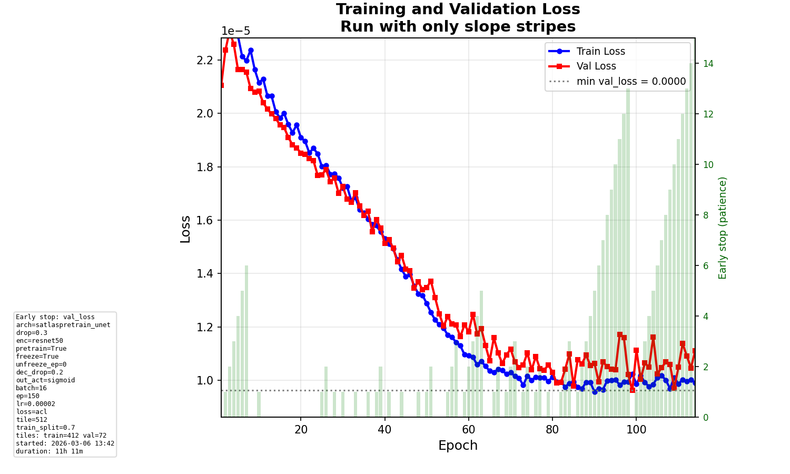

# Daily Diary - Saturday 07 March 2026

## Context

Current date: **2026-03-07**. Last diary: 2026-03-05 (ACL runs, early stopping, run intention tag, shadow mask).

We are on the **real production dataset** (512×512). This period added **configurable input channels** (use_rgb, use_dem, use_slope, use_segmentation_layer, use_slope_stripes_channel) and a **SlopeStripes-only** experiment to test whether that single layer carries enough signal.

---

## Model runs (since 2026-03-05)

Experiment `586083506121040615`. Runs from 5–7 Mar:

| Run ID (short) | best val_loss | best val_mae | in_channels | use_rgb | use_seg | use_slope_stripes | loss | notes |
|----------------|---------------|--------------|------------|---------|---------|-------------------|------|-------|
| **a26f411a**   | **9.62e-6**   | 0.390        | 5*         | false   | false   | true              | acl  | SlopeStripes-only experiment (production); ACL, lr 2e-5, 150 epochs |
| **cff79125**   | 9.75e-6       | 0.380        | 5          | —       | true    | true              | acl  | Full channels (RGB+DEM+Slope+Seg+SlopeStripes); ACL, lr 2e-5 |

\* a26f411a was run with only SlopeStripes enabled in config (use_rgb false, use_segmentation_layer false; use_dem/use_slope may still have been true in config at log time). Effective input: reduced channel set. Model used **InputAdapter** with single-channel path (see Code changes).

**Best in this window:** **a26f411a** has slightly better val_loss (9.62e-6 vs 9.75e-6); **cff79125** has slightly better val_mae (0.380 vs 0.390). Both are ACL loss, same scale; difference is small. SlopeStripes-only is **competitive** with full-channel run.

### Parameter differences

- **a26f411a:** Config toggles set to **SlopeStripes only** (use_rgb false, use_segmentation_layer false). Fewer input channels → faster data loading; same encoder/decoder after InputAdapter.
- **cff79125:** Default full stack (RGB, DEM, Slope, Segmentation, SlopeStripes). Same training config otherwise (ACL, lr 2e-5, 150 epochs).

### Loss chart – SlopeStripes-only run (a26f411a)

---

## Conversations and code changes (since 2026-03-05)

### 1. Configurable input layers

- **Config** (`configs/training_config.yaml`): New toggles **use_rgb**, **use_dem**, **use_slope** (default true). Existing **use_segmentation_layer** and **use_slope_stripes_channel**. At least one must be true. Channel order: RGB (3), DEM (1), Slope (1), Segmentation (1), SlopeStripes (1).
- **Dataloader** (`src/training/dataloader.py`): `TileDataset` builds the feature tensor only from **enabled** channels. When only SlopeStripes is on, the 5-band feature file is not read; only slope-stripes tiles and targets are loaded. Normalization stats are skipped when no RGB/DEM/Slope.
- **Train script** (`scripts/train_model.py`): Reads the five flags, computes **in_channels**, validates ≥1, passes flags to dataloaders and all visualization helpers. **CLI:** **`--slope-stripes-only`** sets use_rgb/dem/slope/segmentation to false and use_slope_stripes_channel to true.

### 2. InputAdapter fix for 1-channel input

- **SatlasPretrainUNet** assumes an **InputAdapter** that originally split input into “first 3 = RGB” and “rest = aux”. For **in_channels=1** (SlopeStripes only), aux_channels became −2 → `RuntimeError: negative dimension`.
- **Fix** (`src/models/satlaspretrain_unet.py`): **InputAdapter** now supports any in_channels:
  - **in_channels ≥ 4:** unchanged (first 3 → RGB branch, rest → aux, fusion → 3).
  - **in_channels == 3:** single RGB branch (conv 3→3).
  - **in_channels < 3:** single branch (conv in_channels→3). SlopeStripes-only runs use this path.

### 3. Visualization

- All helpers that build a feature tensor via `TileDataset` (**show_best_predicted_tile**, **show_highest_iou_tile**, **create_prediction_tile_figures**, **create_representative_tiles_channel_figures**) now accept **use_rgb**, **use_dem**, **use_slope** and pass them to the dataset so figures match the training channel set.

### 4. Training speed with fewer channels

- With SlopeStripes-only: **data loading** is faster (one channel, no RGB/DEM/Slope normalization). **GPU** time is only slightly lower (smaller input + cheaper InputAdapter; encoder/decoder unchanged). Typical expectation: ~10–20% faster per epoch if GPU-bound; more if I/O-bound.

---

## Summary vs 2026-03-05

- **Best runs:** a26f411a (SlopeStripes-only) and cff79125 (full channels) are very close: val_loss 9.62e-6 vs 9.75e-6, val_mae 0.390 vs 0.380. SlopeStripes-only is **competitive**.
- **Did we improve?** Focus was on **flexibility** (layer toggles, SlopeStripes-only, InputAdapter fix), not on beating a specific metric. We can now ablate channels easily.
- **Problems solved:** (1) Choice of input layers via config and CLI. (2) Crash for in_channels&lt;3 fixed in InputAdapter (single-channel path).
- **Results vs recent days:** Same ACL setup as 05 Mar; new runs show that **SlopeStripes-only** can match full-channel val_loss/MAE in this setup.

---

## README and commands

- **New in README:** Optional arguments for `train_model.py`: **`--slope-stripes-only`** (use only SlopeStripes channel), **`--use-slope-stripes-channel`** (add SlopeStripes as extra channel). Config: **input layer toggles** (`use_rgb`, `use_dem`, `use_slope`, `use_segmentation_layer`, `use_slope_stripes_channel`) in `configs/training_config.yaml`; at least one must be true.

---

## E2E tests

- **test_minimal_training_run_and_metrics** failed with `num_samples=0` (train dataset empty under e2e config/paths). Same as 2026-03-05; likely dev data or path setup, not caused by this session’s code. **test_minimal_tuning_one_trial** passed. **test_data_prep_then_training** skipped.
- **conftest fix:** `make_minimal_config` now forces **use_rgb**, **use_dem**, **use_slope** to true so the minimal config always has at least one channel enabled regardless of base `training_config.yaml`.

---

## Endday

- Diary entry for **Saturday 07 March 2026**. Date verified via check-datetime.
- Graphics: loss plot for a26f411a (SlopeStripes-only) saved as `plots/2026-03-07_loss_a26f411a.png` and embedded.
- README updated with layer toggles and `--slope-stripes-only` / `--use-slope-stripes-channel`.
- E2E: run suite; push changes.
